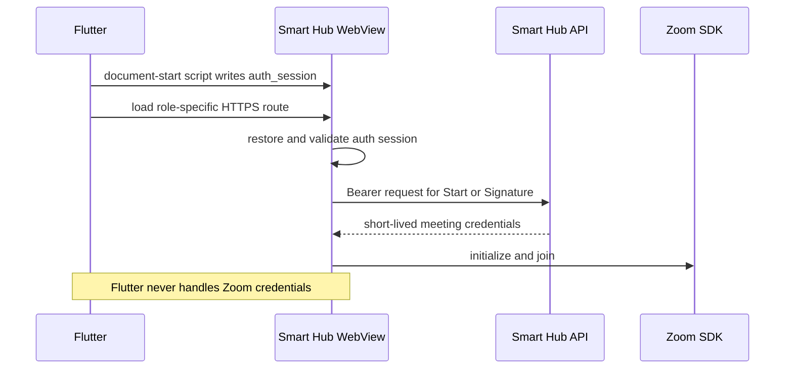

# Flutter WebView Online Meetings

## Scope and assumptions

This guide integrates the Smart Hub web meeting routes into a Flutter mobile shell. The mobile repository was not available during this refactor, so the example assumes Flutter 3.24+/Dart 3.5+ and `flutter_inappwebview: ^6.1.5`. It also uses `permission_handler` for OS media permission prompts allowed by the web iframe policy. The example was not built or run on Android/iOS during this task and is guidance, not release evidence.

Flutter transports authentication only. It never creates, receives from the native login API, injects, logs, or appends Zoom signatures, ZAKs, meeting passcodes, meeting numbers, or SDK client IDs. The web frontend obtains short-lived meeting credentials from the Smart Hub backend.

Online **Sessions and Exams** use a web-owned active-client coordinator before mounting Zoom or requesting credentials. It scopes ownership by authenticated user ID + meeting role + subject type + subject ID, prefers an exclusive Web Lock, and falls back to a heartbeat-backed fenced `localStorage` lease with BroadcastChannel/storage-event coordination. These records contain ownership identifiers and expiry only, never meeting credentials or permission payloads.

## Role and subject behavior

| Flow                         | Frontend URL                                     | SDK role | Native media policy       | Backend call                                                   |
| ---------------------------- | ------------------------------------------------ | -------: | ------------------------- | -------------------------------------------------------------- |
| Teacher Session host         | `/teacher/session/{sessionId}/live`              |        1 | Camera/Mic may be granted | `POST /sessions/{id}/start`                                    |
| Student Session viewer       | `/user/course/{sessionId}/online-session`        |        0 | Camera/Mic denied         | `GET /meetings/signature?subject_type=session&subject_id={id}` |
| Student Online Exam attendee | `/user/exams/{examType}/{examId}/online-session` |        0 | Backend permission matrix | `GET /meetings/signature?subject_type=exam&subject_id={id}`    |

The current web repository has no Assistant Online Exam route. Do not manufacture one in Flutter. Add it only after the web router and backend assignment contract expose an Assistant attendee route.

For Online Exams, the web response permission matrix is authoritative. Protocol v6 configures the SDK and the same-origin Zoom iframe `allow` policy in memory. Camera, Microphone, and display capture are omitted when denied, so the native permission callback must not receive those requests. If a permitted Exam feature causes a trusted same-origin media request, native code may request only those exact OS resources. Flutter must not receive, store, or independently infer the backend permission payload.

Meeting credentials never appear in a frontend URL. The only identifiers are path parameters. Flutter should validate IDs as UUIDs before constructing Student URLs. Teacher IDs are URL-encoded by the web application and should still be treated as opaque identifiers.

For Student Session routes, the web layer first obtains and validates fresh joinability/signature data while no Zoom iframe exists. Backend denial stays in the custom Smart Hub error state and Retry performs a new preflight. Once a valid response permits initialization, Zoom `join` callback success is still not admission: the SDK iframe remains invisible, inert, non-focusable, and pointer-disabled until the runtime proves that the current user is no longer held (`onUserIsInWaitingRoom` reports `false`, or the supported `getCurrentUser()` snapshot reports `isHold: false`) after Join acknowledgement. Meeting status `2` is reconciled with that waiting-room state and is not used alone. Flutter therefore displays only Smart Hub lifecycle UI before admission; Zoom Workplace, its waiting UI, toolbar, and permission banners must never be visible.

Remote Teacher End can move an already-open Student Session to Smart Hub's custom Ended state and retire the iframe. A completed Student Session after a fresh route load/hard refresh is not yet contract-complete: this repository has no confirmed Student Session status/detail endpoint, and the Signature contract has no confirmed stable machine-readable `completed` discriminator. Flutter must not invent an endpoint or infer status from localized error text. Release remains blocked until the backend supplies one of those authoritative contracts.

## Exact auth storage contract

The frontend reads this exact localStorage entry:

```text
key: auth_session
value: JSON string
```

Its decoded value is:

```json
{
  "token": "BEARER_TOKEN_WITHOUT_THE_BEARER_PREFIX",
  "role": "student",
  "portal": "user",
  "user": {
    "id": "user-id",
    "role": "student",
    "type": "student",
    "name": "Student Name",
    "email": "student@example.com",
    "phone": null,
    "group": {
      "id": "subgroup-id",
      "name": "Section A",
      "parent": { "id": "group-id", "name": "Grade 10" }
    }
  },
  "persistence": "persistent"
}
```

Teacher uses `role: "teacher"` and `portal: "teacher"`. The `user` object must be the authenticated API user, not a partial invented object. The web validator requires a non-empty token, a valid role/portal pair, a user object, and `persistence` equal to `session` or `persistent`.

Use `persistent` in a native WebView unless the native integration also manages the frontend's `auth_browser_session=1` session-marker cookie. A `session` value without that cookie is intentionally discarded. Never put the token in the URL. JSON-encode both the stored value and the JavaScript string literal; do not interpolate an unescaped token.

## Authentication sequence



## Complete Flutter example

```yaml
# pubspec.yaml
dependencies:
  flutter:
    sdk: flutter
  flutter_inappwebview: ^6.1.5
  permission_handler: ^11.3.1 # Pin to the mobile repository's approved version.
```

```dart
import 'dart:collection';
import 'dart:convert';

import 'package:flutter/material.dart';
import 'package:flutter/services.dart';
import 'package:flutter_inappwebview/flutter_inappwebview.dart';
import 'package:permission_handler/permission_handler.dart';

enum MeetingWebRole { teacher, student }

class SmartHubMeetingWebView extends StatefulWidget {
  const SmartHubMeetingWebView({
    super.key,
    required this.appOrigin,
    required this.meetingPath,
    required this.bearerToken,
    required this.role,
    required this.userJson,
    required this.onExit,
  });

  /// Example: https://app.example.com (no trailing slash).
  final Uri appOrigin;

  /// Example: /teacher/session/abc/live or
  /// /user/course/{uuid}/online-session.
  final String meetingPath;
  final String bearerToken;
  final MeetingWebRole role;
  final Map<String, dynamic> userJson;
  final VoidCallback onExit;

  @override
  State<SmartHubMeetingWebView> createState() =>
      _SmartHubMeetingWebViewState();
}

class _SmartHubMeetingWebViewState extends State<SmartHubMeetingWebView>
    with WidgetsBindingObserver, AutomaticKeepAliveClientMixin {
  InAppWebViewController? _controller;
  int _progress = 0;
  String? _mainFrameError;
  bool _disposed = false;

  @override
  bool get wantKeepAlive => true;

  String get _role =>
      widget.role == MeetingWebRole.teacher ? 'teacher' : 'student';

  String get _portal =>
      widget.role == MeetingWebRole.teacher ? 'teacher' : 'user';

  Uri get _meetingUri => widget.appOrigin.resolve(widget.meetingPath);

  String _authStorageScript(String token) {
    if (token.trim().isEmpty) {
      throw ArgumentError('A non-empty bearer token is required.');
    }

    final user = Map<String, dynamic>.from(widget.userJson)
      ..['role'] = _role
      ..putIfAbsent('type', () => _role);

    final storedSession = jsonEncode(<String, dynamic>{
      'token': token,
      'role': _role,
      'portal': _portal,
      'user': user,
      'persistence': 'persistent',
    });

    // jsonEncode(storedSession) produces a safe JavaScript string literal.
    // Never print either value.
    return "localStorage.setItem('auth_session', ${jsonEncode(storedSession)});";
  }

  UserScript _documentStartAuthScript(String token) => UserScript(
        source: _authStorageScript(token),
        injectionTime: UserScriptInjectionTime.AT_DOCUMENT_START,
        forMainFrameOnly: true,
      );

  @override
  void initState() {
    super.initState();
    WidgetsBinding.instance.addObserver(this);
  }

  @override
  void didUpdateWidget(covariant SmartHubMeetingWebView oldWidget) {
    super.didUpdateWidget(oldWidget);
    if (oldWidget.bearerToken != widget.bearerToken ||
        oldWidget.userJson != widget.userJson) {
      _replaceAuthSession(widget.bearerToken);
    }
  }

  Future<void> _replaceAuthSession(String token) async {
    final controller = _controller;
    if (controller == null || _disposed) return;
    await controller.evaluateJavascript(source: _authStorageScript(token));
    // Reload only for an actual auth change. Normal background/resume must not
    // recreate the meeting or issue another Start/Signature request.
    await controller.reload();
  }

  Future<void> clearAuthForLogout() async {
    final controller = _controller;
    if (controller == null || _disposed) return;
    await controller.evaluateJavascript(
      source: "localStorage.removeItem('auth_session');",
    );
  }

  Future<bool> _requestOsMediaPermissions(
    List<PermissionResourceType> resources,
  ) async {
    final permissions = <Permission>{
      if (resources.contains(PermissionResourceType.CAMERA))
        Permission.camera,
      if (resources.contains(PermissionResourceType.MICROPHONE))
        Permission.microphone,
    };
    if (permissions.isEmpty) return false;
    final results = await permissions.toList().request();
    return results.values.every((status) => status.isGranted);
  }

  Future<PermissionResponse?> _handleWebPermissionRequest(
    PermissionRequest request,
  ) async {
    final requestOrigin = request.origin;
    final trustedOrigin = requestOrigin.scheme == widget.appOrigin.scheme &&
        requestOrigin.host == widget.appOrigin.host &&
        requestOrigin.port == widget.appOrigin.port;
    if (!trustedOrigin) {
      return PermissionResponse(
        resources: request.resources,
        action: PermissionResponseAction.DENY,
      );
    }

    final permittedTypes = <PermissionResourceType>{
      PermissionResourceType.CAMERA,
      PermissionResourceType.MICROPHONE,
    };
    final requestedOnlyMedia =
        request.resources.every(permittedTypes.contains);
    // For Students, the same-origin iframe permissions policy has already
    // removed every resource denied by the backend Exam permission matrix.
    // Flutter grants only the exact trusted resources that reach this callback.
    final osGranted = requestedOnlyMedia &&
        await _requestOsMediaPermissions(request.resources);

    return PermissionResponse(
      resources: request.resources,
      action: osGranted
          ? PermissionResponseAction.GRANT
          : PermissionResponseAction.DENY,
    );
  }

  NavigationActionPolicy _navigationPolicy(NavigationAction action) {
    final uri = action.request.url;
    if (uri == null) return NavigationActionPolicy.CANCEL;

    // Resource requests and the same-origin Zoom iframe are not main-frame
    // navigations. Only constrain what can replace the application page.
    if (action.targetFrame?.isMainFrame != true) {
      return NavigationActionPolicy.ALLOW;
    }

    final allowed = uri.scheme == 'https' &&
        uri.scheme == widget.appOrigin.scheme &&
        uri.host == widget.appOrigin.host &&
        uri.port == widget.appOrigin.port;
    return allowed
        ? NavigationActionPolicy.ALLOW
        : NavigationActionPolicy.CANCEL;
  }

  Future<void> _notifyWebResume() async {
    final controller = _controller;
    if (controller == null || _disposed) return;
    await controller.evaluateJavascript(
      source: "window.dispatchEvent(new Event('smart-hub:webview-resume'));",
    );
  }

  @override
  void didChangeAppLifecycleState(AppLifecycleState state) {
    if (state == AppLifecycleState.resumed) {
      _notifyWebResume();
    }
  }

  Future<void> _retry() async {
    setState(() => _mainFrameError = null);
    await _controller?.reload();
  }

  Future<void> _handleBack() async {
    final controller = _controller;
    if (controller != null && await controller.canGoBack()) {
      await controller.goBack();
      return;
    }
    widget.onExit();
  }

  @override
  Widget build(BuildContext context) {
    super.build(context);
    return PopScope(
      canPop: false,
      onPopInvokedWithResult: (didPop, result) {
        if (!didPop) _handleBack();
      },
      child: Scaffold(
        body: SafeArea(
          child: Stack(
            children: [
              InAppWebView(
                key: const ValueKey('smart-hub-meeting-webview'),
                initialUrlRequest: URLRequest(url: WebUri(_meetingUri.toString())),
                initialUserScripts: UnmodifiableListView<UserScript>([
                  _documentStartAuthScript(widget.bearerToken),
                ]),
                initialSettings: InAppWebViewSettings(
                  javaScriptEnabled: true,
                  domStorageEnabled: true,
                  databaseEnabled: true,
                  useShouldOverrideUrlLoading: true,
                  mediaPlaybackRequiresUserGesture: false,
                  allowsInlineMediaPlayback: true,
                  allowsAirPlayForMediaPlayback: true,
                  useHybridComposition: true,
                  supportZoom: false,
                  transparentBackground: false,
                ),
                onWebViewCreated: (controller) => _controller = controller,
                onProgressChanged: (_, value) {
                  if (mounted) setState(() => _progress = value);
                },
                shouldOverrideUrlLoading: (_, action) async =>
                    _navigationPolicy(action),
                onPermissionRequest: (_, request) =>
                    _handleWebPermissionRequest(request),
                onReceivedError: (_, request, error) {
                  if (request.isForMainFrame == true && mounted) {
                    setState(() => _mainFrameError = error.description);
                  }
                },
                onConsoleMessage: (_, message) {
                  // Intentionally do not forward WebView console output to
                  // analytics or native logs; it might contain user data.
                },
              ),
              if (_progress < 100 && _mainFrameError == null)
                LinearProgressIndicator(value: _progress / 100),
              if (_mainFrameError != null)
                ColoredBox(
                  color: Theme.of(context).colorScheme.surface,
                  child: Center(
                    child: Padding(
                      padding: const EdgeInsets.all(24),
                      child: Column(
                        mainAxisSize: MainAxisSize.min,
                        children: [
                          const Icon(Icons.cloud_off, size: 40),
                          const SizedBox(height: 12),
                          const Text('Unable to open the meeting'),
                          const SizedBox(height: 16),
                          FilledButton(
                            onPressed: _retry,
                            child: const Text('Try again'),
                          ),
                        ],
                      ),
                    ),
                  ),
                ),
            ],
          ),
        ),
      ),
    );
  }

  @override
  void dispose() {
    _disposed = true;
    WidgetsBinding.instance.removeObserver(this);
    _controller = null;
    super.dispose();
  }
}
```

Production applications should localize the native loading/error copy and supply a stable widget key/controller through orientation changes. Do not construct a new meeting widget on every `build`.

## Android setup

```xml
<!-- android/app/src/main/AndroidManifest.xml -->
<manifest xmlns:android="http://schemas.android.com/apk/res/android">
  <uses-permission android:name="android.permission.INTERNET" />
  <uses-permission android:name="android.permission.CAMERA" />
  <uses-permission android:name="android.permission.RECORD_AUDIO" />
  <application
      android:usesCleartextTraffic="false"
      android:hardwareAccelerated="true">
    <!-- existing Flutter activity -->
  </application>
</manifest>
```

- Use HTTPS in every environment that hosts real meetings.
- Request Android Camera/Microphone permissions only after a trusted web request. A denied Student Exam permission never reaches the native callback because the iframe policy omits it.
- Hardware acceleration, DOM storage, JavaScript, WebRTC, and autoplay are required.
- Test activity recreation with “Don’t keep activities”. Persist route/auth inputs in native state; never persist Zoom credentials.

## iOS setup

```xml
<!-- ios/Runner/Info.plist -->
<key>NSCameraUsageDescription</key>
<string>Smart Hub uses the camera for an authorized live meeting feature.</string>
<key>NSMicrophoneUsageDescription</key>
<string>Smart Hub uses the microphone for an authorized live meeting feature.</string>
```

Keep App Transport Security strict and use HTTPS. Do not add an arbitrary-load exception for production. `allowsInlineMediaPlayback` and no user-action media restriction enable attendee audio/video playback. The native callback rejects untrusted origins and non-media resources; the web iframe policy prevents backend-denied Student capture requests from reaching it.

## Lifecycle and token refresh

- Backgrounding does not mean End. Preserve the controller and meeting route.
- On resume, dispatch `smart-hub:webview-resume`. The Teacher deadline hook immediately recomputes remaining time and the host route refetches authoritative Session status. A participant in joining, waiting, or reconnecting requests a safe runtime snapshot; an admitted runtime relies on Zoom connection events.
- A Session or Exam route acquires subject-scoped active-client ownership before creating the iframe or requesting credentials. A conflicting web client shows the custom ownership state and makes no credential request.
- Android recreation may reload the route. A live Teacher route first reads authoritative detail, reacquires a new ownership fence, then calls Start once for fresh credentials and rejoins the same meeting.
- iOS may suspend JavaScript indefinitely. The frontend catches up after resume but cannot run while suspended.
- Orientation must resize the existing WebView, not replace it.
- On token refresh, replace the complete `auth_session` value with safe JSON encoding, then reload once. On logout, remove `auth_session` and navigate away.
- If the OS terminates the process or all host clients close, frontend auto-end cannot execute. An authoritative backend scheduler must End expired Sessions.

Web Locks and the fallback lease coordinate only web contexts that share the same origin/storage partition. Separate native WebView data stores, isolated browser profiles, or different devices may not see one another. Treat this as duplicate-client mitigation, not server-side authorization; backend Session status and idempotent Start/End remain authoritative.

On an explicit Student Session Leave, the web layer sends SDK Leave and waits for a bounded release acknowledgement before retiring the iframe, releasing ownership, and navigating. During `pagehide`/process exit it can only send Leave best-effort and retire locally. A Teacher page exit deliberately performs local retirement and ownership release **without host SDK Leave**, because the host Leave path can end the meeting for every participant. Only the explicit/coordinated Teacher End flow may request host End.

If Zoom classifies Join failure as stale/invalid credentials, the web layer creates one fresh iframe lifecycle and requests credentials one more time. Teacher first refetches authoritative detail; Student requests one fresh Signature. A second credential failure is terminal and requires explicit user recovery. There is no credential vault or cross-route credential handoff.

## Error mapping and retry

- `401`: clear auth and return to native login.
- `403`: assigned role cannot access the subject; do not retry automatically.
- `409` on Teacher Start: another Session is live; show the translated web error.
- Too early/expired window: keep the Smart Hub custom not-joinable state only when the backend supplies the approved machine-readable reason, and allow an explicit retry only.
- SDK init/join failure: web UI retires the iframe lifecycle and reloads a fresh one on explicit retry.
- Credential-classified Join failure: web UI performs at most one fresh credential/lifecycle retry; it never loops or reuses the failed payload.
- Network loss: keep the WebView alive; Zoom connection events drive the custom Reconnecting state.
- Main-frame TLS/navigation failure: show the native retry layer. Never display raw response bodies or tokens.

For a freshly loaded completed Student Session, do not map `completed` until the approved status/discriminator contract exists. Remote End in the currently open page is supported; completed-after-refresh remains an explicit release blocker.

## WebView QA checklist

- Teacher Camera/Mic prompts occur only after Teacher action/Zoom request; both media tracks and screen share work.
- Student Session never prompts for Camera/Mic. Student Exam prompts only when the backend permission matrix allows the feature and the trusted iframe requests it.
- A receive-only Online Exam stays outside the iframe tab order and has no functional local-media controls; remote playback still works.
- A hostless Online Exam Waiting Room or wait-for-host signal becomes translated Smart Hub error UI with Retry and Back.
- Refresh obtains a new ownership fence and fresh Exam credentials; reconnect snapshots do not create a second Join.
- Student waiting shows only Smart Hub UI; the Zoom iframe remains inaccessible until connected and remains non-interactive afterward.
- Student can hear Teacher and view Teacher video/screen share.
- External Leave releases attendee resources and never calls Session End.
- Explicit Student Leave waits for bounded SDK release; process/page exit is best-effort and ownership expiry is the fallback.
- Teacher page exit never sends host SDK Leave or backend End; returning to an authoritative Live Session obtains fresh ownership and credentials.
- A second same-scope Session WebView creates no iframe/Start/Signature until it owns the fenced client lease; takeover retires the incumbent first.
- Late Start/Signature responses from a replaced ownership fence never reach SDK Join.
- Auth logout/identity changes advance the web Query-cache epoch; Online Session Start, recovery, and End work rejects results from an older epoch. This is a Session guarantee, not a claim that unrelated application mutations are globally cancellable.
- Remote Teacher End shows the custom Student Ended state in an already-open page.
- Completed Student Session after a fresh load is marked blocked until the backend status/discriminator contract is approved.
- Background/resume during join, reconnect, warning threshold, and expired deadline recovers correctly.
- Android recreation and iOS suspension use fresh credentials; no credential appears in storage, URL, logs, screenshots, or analytics.
- Main-frame navigation cannot escape the configured Smart Hub origin.
- Token refresh replaces storage safely; logout removes it.
- Portrait/landscape and 320/375/768/1024 widths keep End/Leave reachable above safe areas and keyboards.

## Troubleshooting

- Immediate logout after injection usually means the stored JSON shape is invalid or `persistence: "session"` was used without the session-marker cookie.
- A Student Camera or Microphone prompt is valid only for an Online Exam whose backend permission matrix allows that exact capability. If the corresponding iframe `allow` token is absent, deny and investigate; never grant as a workaround. The pinned Zoom 6.2.0 runtime hides its in-SDK `KB0078476` capture notice when capture is denied while preserving remote playback.
- A blank Zoom surface with Smart Hub error UI usually means the isolated `zoom-client-view.html` was rewritten by an SPA fallback or Zoom assets were blocked.
- Repeated Start/Signature calls usually mean the WebView widget/controller is being recreated. Preserve it and dispatch the resume event instead.
- A persistent “meeting active elsewhere” state means another same-scope owner still holds the Web Lock/lease. Use the custom Take Over action and verify that the incumbent retires before the new client requests credentials; do not delete coordination storage manually.
- Two isolated WebView data stores/devices cannot rely on browser locks to coordinate; inspect authoritative backend state and do not treat client ownership as a security boundary.
- “Waiting for the Teacher” on an Online Exam indicates stale web assets or incorrect routing. The current Exam controller classifies Waiting Room/wait-for-host as incompatible hostless Zoom configuration.
- A completed Student Session that requests Signature again after process recreation reflects the unresolved Student status contract; do not guess an endpoint or parse localized text as status.
- Host credentials missing a separate `sdk_client_id` field are expected. The web layer validates the role-1 JWT and forwards its non-empty signed `appKey` as the Client View Join `sdkKey`; Flutter must neither invent nor transport that value.
