# Online Meetings Implementation Study Guide

## 1. What was built

Smart Hub embeds Zoom Meeting SDK Client View 6.2.0 inside the same-origin `zoom-client-view.html` document. The iframe isolates Zoom's document-level CSS and runtime changes from the React application. React owns business rules, credentials, custom lifecycle UI, routing, timing, and API cache coordination; the iframe owns direct Zoom SDK calls.

The reusable core supports these subjects and roles:

```ts
type MeetingSubjectType = 'session' | 'exam'
type MeetingRole = 'teacher-host' | 'student-viewer' | 'assistant-attendee'
```

Teacher is the sole Session host. Student is a view-only Session attendee. Student Online Exam continues to use the attendee infrastructure without Session Start, Session End, or Session timing. The repository currently has no Assistant Online Exam route, so the core defines the policy but no unsupported route was invented.

## 2. Zoom concepts and credentials

- **Meeting number** identifies the Zoom meeting.
- **Passcode** is the meeting passcode. It is sensitive and remains in transient memory.
- **Meeting SDK JWT signature** authorizes one SDK join. Its claims include application identity, meeting number, role, and expiry.
- **SDK role 1** is the host role used by Teacher.
- **SDK role 0** is the attendee role used by Student/Assistant policies.
- **ZAK** is a Zoom Access Key required for an authenticated Zoom user to start/join as host. Attendees never receive it.
- **SDK client ID / SDK key** must be present in the Client View Join payload. The participant endpoint returns it directly and the web client validates it against the signed JWT. The Teacher Start response does not return a separate client-ID field, so the web client reads the `appKey` from the already validated role-1 JWT and passes that same value as `sdkKey`; it never invents or persists a key.
- **video WebRTC mode** is validated against the JWT where present. It is not a UI preference.

Only the backend can safely hold Meeting SDK secrets and generate signatures/ZAK. Browser- or Flutter-generated credentials would expose the signing secret and bypass assignment/status checks.

## 3. Business-rule split

| Concern                | Teacher Session                | Student Session | Student Exam       |
| ---------------------- | ------------------------------ | --------------- | ------------------ |
| Start API              | Yes                            | No              | No                 |
| End API                | Yes                            | No              | No                 |
| Auto-end               | Yes, while host page is active | No              | No                 |
| SDK role               | 1                              | 0               | 0                  |
| ZAK                    | Required                       | Forbidden       | Forbidden          |
| Toolbar/media controls | Host controls                  | Hidden/disabled | Hidden/disabled    |
| External action        | End Session                    | Leave Session   | Leave Exam Meeting |

Admin Session creation was not changed. Offline Sessions never route into Zoom.

## 4. Architecture

```text
src/modules/shared/meeting/
  types/          shared subjects, roles, lifecycle, permissions, End reasons
  policy/         immutable host and view-only role policies
  lifecycle/      legal transition table and React reducer hook
  credentials/    allowlisted cleanup for legacy Zoom-owned meeting storage only
  coordination/   active-client ownership, non-secret Start intent, End coordinator
  timing/         deadline math and drift-resistant browser/WebView hook
  sdk/            iframe protocol, runtime helpers, URL and pinned version
  components/     lifecycle, ownership, custom ended state, surface, warning

src/modules/shared/zoom/components/ZoomMeetingFrame.tsx
  typed same-origin iframe adapter: join, controlled leave/release, end,
  local retirement, reload

src/zoom-client-view/main.ts
  direct SDK adapter/runtime: init, join, leave, end, connection events, release

src/modules/teachers/Teacher/session/
  services + React Query + list controller + host subject controller

src/modules/users/shared/meeting/
  participant services + role-0 validation + Session/Exam attendee controller
```

There is one iframe SDK instance per mounted meeting surface. The adapter uses an exact origin, iframe `Window` source, protocol version, random load nonce, iframe lifecycle ID, and join attempt ID. Stale or foreign messages are ignored.

For an Online Session, mounting the surface is additionally gated by one active-client owner for the exact authenticated user + meeting role + Session ID. The preferred backend is an exclusive Web Lock. Browsers without Web Locks use a fenced `localStorage` lease with heartbeat plus `BroadcastChannel`/storage-event coordination. No signature, ZAK, passcode, token, or meeting number is written to the lock, lease, or coordination messages.

## 5. Explicit lifecycle

The core states are:

```text
idle → validating → fetching_credentials → initializing → joining → waiting_for_host / waiting_room → joined
                                                        ↘ error
joined ⇄ reconnecting
any active host state → ending → ended
error → validating/initializing/ending
```

`meeting-lifecycle.ts` contains the legal transition table; illegal events keep the existing state. Role permissions are deliberately separate. This prevents “Student UI state” from accidentally enabling an SDK capability.

The iframe additionally reports runtime loading/ready, join acknowledgement, joining, waiting for host/admission, joined, connecting, reconnecting, reconnected, disconnected, participant-left, host-ended, left, ended, typed failures, and cleanup.

## 6. SDK adapter and customization

`ZoomMeetingFrame` never exposes the raw Zoom object. Parent commands are typed:

- `zoom-parent-init`
- `zoom-sync-request`
- `zoom-join`
- `zoom-leave`
- `zoom-end`
- `zoom-cleanup`

Participant initialization keeps AV and VoIP receive support enabled so the viewer can hear and see the Teacher, while chat, non-verbal actions, polling, Q&A, breakout, screen share, preview, invite, call-out, record, report, meeting header, video dragging/header, Picture-in-Picture, Zoom Phone, and the footer are disabled. `isLockBottom: false` is Zoom's supported footer-hiding option. `disableZoomLogo: true` removes the Zoom Workplace header for this pinned SDK, but Zoom documents that option as subject to future removal; moving to Zoom Video SDK would be required if a future Meeting SDK version removes it. The participant iframe delegates only `autoplay; fullscreen`; the native Student WebView separately denies Camera/Microphone requests. Browser capture-prompt behavior and receive-only playback still require real-browser evidence. The backend role-0 signature and all-false permission object remain authoritative.

Participant `join` callback success is not treated as admission. The iframe subscribes to `onMeetingStatus`, `onUserIsInWaitingRoom`, and leave events before Parent Join is enabled. Admission requires Join acknowledgement plus authoritative evidence that the current user is not held, using the self waiting-room event and the supported `getCurrentUser().isHold` snapshot; status `2` is supporting connection evidence, not a standalone reveal signal. Until then, the SDK surface remains invisible, inert, non-focusable, and pointer-disabled behind the Smart Hub Waiting for the Teacher state. A bounded `PARENT_SYNC_REQUEST` / `IFRAME_STATE_SNAPSHOT` exchange recovers missed events and WebView resumes without a second Signature or Join. Once admitted, the iframe remains pointer-disabled and outside the tab order; only remote meeting content and the external Smart Hub Leave action are available.

The active surface has the scoped, non-interactive overlay:

```text
bg-[linear-gradient(90deg,#2563EB33_0%,#FFFFFF33_50%,#2563EB33_100%)]
pointer-events-none
```

Smart Hub covers SDK loading/join/error states with its own accessible lifecycle panel. Host controls remain Zoom-supported controls after connection. For pinned Client View 6.2.0 and Student Sessions only, links whose `href` contains Zoom support article `KB0078476` are traced to the enclosing `.notification-message-wrap`, marked with `data-smart-hub-view-only-permission-notice`, and hidden by scoped CSS. Unrelated notices, protocol permission errors, and Online Exam notices remain visible. This exact DOM integration is version-coupled and must be revalidated before any SDK upgrade.

## 7. Active-client ownership

Within one same-origin storage partition/browser profile, Online Sessions allow only one active Smart Hub SDK client per authenticated user, meeting role, and Session. Ownership is acquired before the iframe is mounted and before Start/Signature is requested. A second tab or WebView in that partition shows a custom conflict state and may request a cooperative takeover. The incumbent retires its meeting runtime before releasing ownership; the successor then acquires a new fence and obtains fresh credentials. Separate profiles, isolated WebViews, and devices still require backend fencing if device-wide exclusivity is a product requirement.

Every asynchronous credential operation captures the current ownership fence. A late response is ignored unless that exact fence is still the owner immediately before the SDK Join command. In the storage fallback, the lease is renewed periodically and expires when heartbeats stop; replacement, expiry, or unavailable storage causes ownership loss and local retirement. This is client-side duplicate prevention, not a server authorization primitive.

Online Exams deliberately remain outside this Session ownership scope so the stabilization does not change their established behavior.

## 8. Teacher Start and rejoin

The list uses URL-backed search, group, subgroup, type, status, and date filters. Query keys include every filter. Statistics are derived exactly from `paginate.total` and `extra` with a zero-total guard.

The list does not call Start and never receives meeting credentials. Before navigation it force-fetches the authoritative Session detail, writes the result through the monotonic cache reconciler, and blocks Offline or completed Sessions. For an Upcoming Online Session it records a one-use, short-lived **non-secret Start intent** containing only the Session ID behind an opaque lifecycle ID. Router state carries only that lifecycle ID. A Live Online Session navigates without an intent.

The host room reads authoritative detail before creating an ownership scope. A completed response renders the custom ended state and creates no iframe, ownership lease, or Start request. Once the room owns the active-client fence and the runtime is ready, a valid Upcoming intent or authoritative Live status triggers exactly one Start request. Direct Upcoming routes without an intent keep the explicit Start action. Response validation requires the expected Session ID, `type=online`, `status=live`, non-empty signature/ZAK/meeting number/passcode, integer WebRTC mode, a fresh role-1 JWT, a non-empty signed `appKey`, and matching meeting number. The validated `appKey` is forwarded as the Join `sdkKey`.

Credentials exist transiently in the current React Query mutation/async operation and the exact Join message to the owned iframe. Mutation data is reset immediately after mapping and is removed with `gcTime: 0`. Credentials are never placed in query cache, router state, storage, Zustand, or a reusable vault. Refreshing a Live route rechecks detail, reacquires ownership, and obtains fresh credentials once; it cannot recover or reuse an earlier credential set.

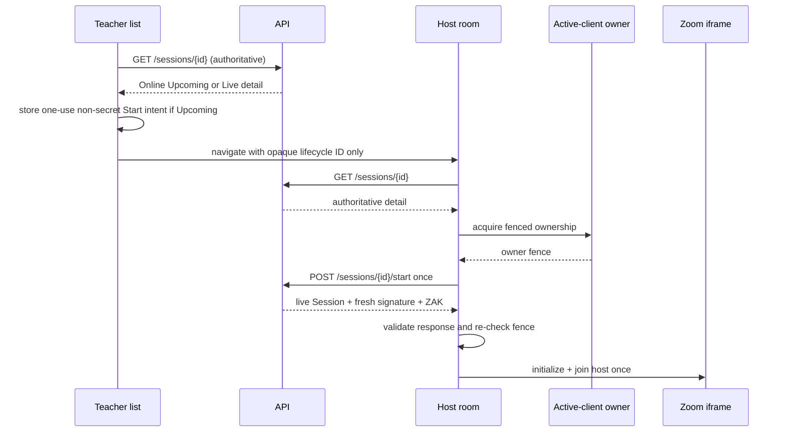

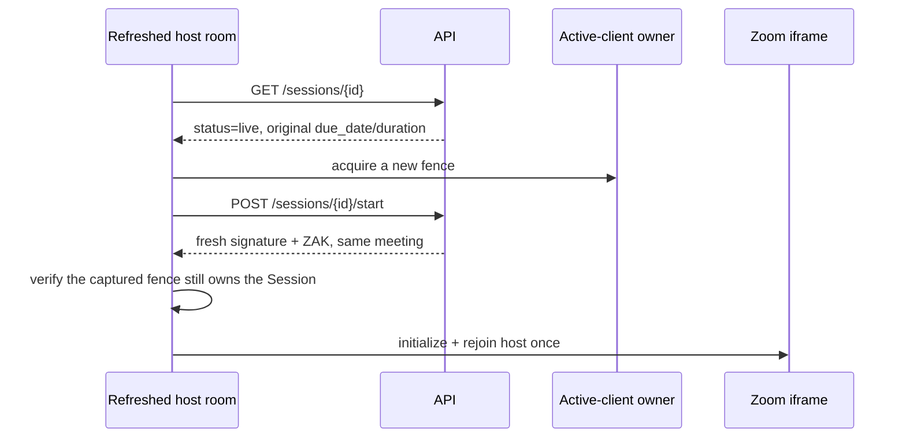

A Start `409` is shown as the translated another-live-Session conflict with no automatic retry. Offline and completed cards have no Zoom action. Status is monotonic across detail and every loaded list (`upcoming < live < completed`), including when the newer value exists only in another cache. Start does not cancel an in-flight status read; it writes the reconciled resource and invalidates the exact detail plus Session lists. End patches detail and every loaded list immediately, removes the Session from mismatched status-filtered caches, and invalidates Session lists narrowly.

## 9. Student join and authoritative permissions

The participant controller validates a UUID route ID before requesting credentials. It uses a React Query mutation with `gcTime: 0`, no automatic retry, and an AbortSignal. After mapping the response it resets mutation data.

The response is accepted only when:

- `role === 0`;
- every returned permission is `false` according to the view-only role policy;
- required fields are present;
- JWT role is 0, meeting number and app identity match, WebRTC mode matches, and expiry is fresh.

Only then does the iframe initialize/join. For a Student/Assistant **Session**, active-client ownership is acquired first and the ownership fence is checked after the credential response and immediately before Join. Backend denial produces a custom error with explicit retry and no request loop. Online Exams continue through the existing participant path without Session ownership.

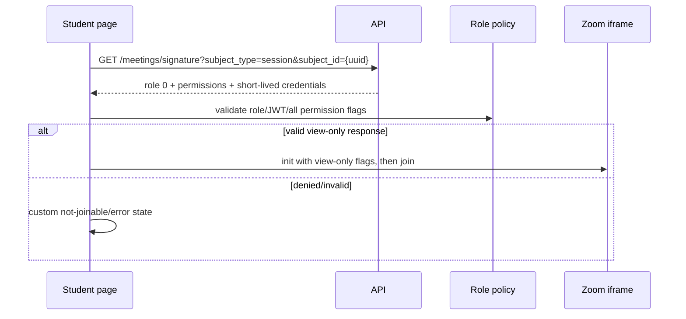

External Leave for a participant Session requests SDK Leave and waits for a bounded release acknowledgement before retiring the iframe, releasing ownership, and navigating. If the page is exiting and cannot await, it sends Leave best-effort and retires locally. It never calls Teacher End or completes a Session.

When the runtime classifies a Join failure specifically as stale/invalid credentials, the participant Session retires the failed iframe and obtains a fresh signature for one new lifecycle **once**. A second credential failure becomes a custom terminal error. Teacher recovery also runs at most once, but first refetches authoritative detail: completed renders Ended; only an Online Live result may create a new iframe and call Start again.

For a Student Session, an exact remote `zoom-host-ended` or `zoom-ended` event immediately retires the iframe, releases ownership, records a non-secret terminal marker scoped to authenticated Student ID + exact Session ID in the in-memory React Query cache, patches a matching Student Home live banner to `null`, and marks only the Student Home query stale. The page shows one accessible Session-ended alert dialog over the persistent “No live session now” state. Dismissing the dialog never retries or reacquires the SDK. Revisiting that exact route during the same application lifecycle reads the terminal marker before ownership or credential preflight; another Session ID remains unaffected. Student Home explicitly refetches stale data on its next mount so server truth replaces the optimistic banner patch without a page reload.

There is a remaining Student hard-refresh contract blocker. The repository has no confirmed Student Session status/detail contract, and the Signature response/denial does not provide a confirmed stable machine-readable discriminator for `completed`. A new document lifecycle loses the deliberately non-persistent terminal marker, so a fresh Student route cannot safely distinguish completed from unauthorized, unassigned, too early, or network failure. Production completion requires either an approved Student Session status/detail endpoint or an approved stable completed/not-started discriminator in the existing contract. Do not persist credentials or inferred lifecycle state, invent an endpoint, infer status from localized error text, or collapse other denial/error cases into completed.

## 10. Online Exam compatibility

Online Exams are hostless. Student is an attendee, Teacher/Admin cannot enter the route, and no Exam client receives ZAK or calls Session Start/End. Zoom connection state never replaces Exam availability, timing, draft, upload, submission, or completion state.

### 10.1 Student attendee flow

The official web route remains `/user/exams/:examType/:examId/online-session`. The route and `useExamRouteGuard` require an authenticated Student, `examType=online`, a valid assigned Exam, and the existing local join window. The backend is still authoritative when the page requests `GET /meetings/signature?subject_type=exam&subject_id={uuid}`.

The participant controller acquires ownership before requesting credentials. A successful response is validated for a fresh role-0 JWT, matching meeting number, SDK client ID, WebRTC mode, passcode shape, and a complete boolean permission matrix. The iframe is not created until this preflight succeeds. Listeners are installed before the single Join command, and the Zoom surface is revealed only after an admitted snapshot or joined event.

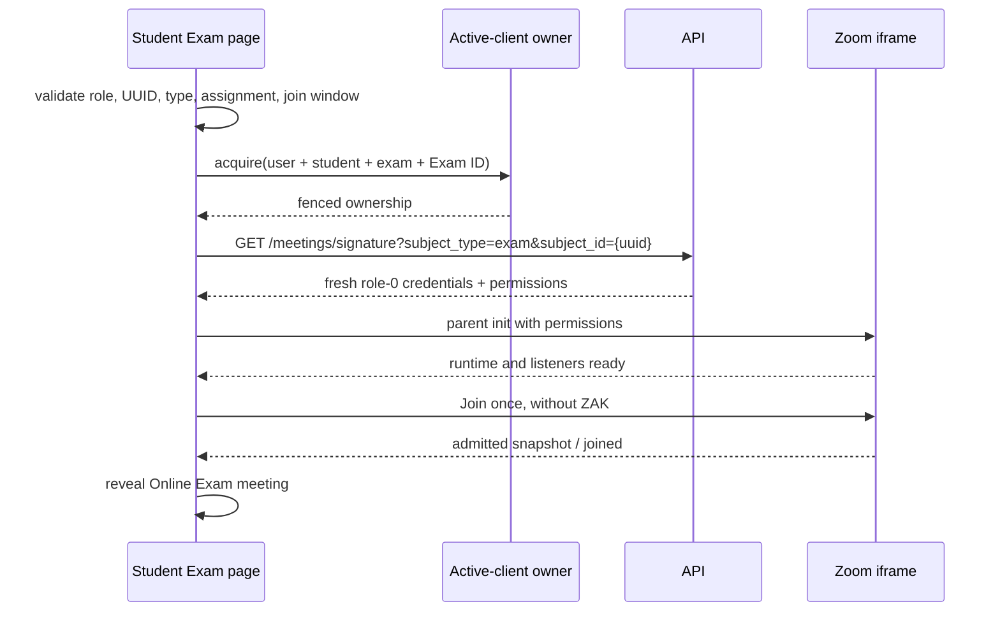

### 10.2 Assistant attendee flow and current contract boundary

The shared controller, protocol, SDK runtime, role type, and ownership scope support `assistant-attendee`. The current repository does not contain an Assistant Online Exam credentials endpoint, query contract, permission response, join-window errors, or meeting route. Assistant exam services currently cover list, details, students, reminders, export, and grading only. Therefore no endpoint or route was invented, and Assistant remains denied until that backend contract is supplied.

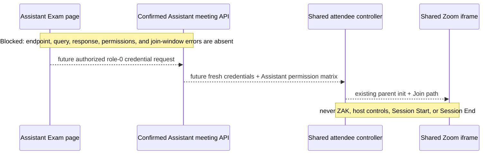

### 10.3 Permission enforcement

Backend permissions are normalized once and remain in memory for the current lifecycle. They are sent through protocol v6 in the parent-init and Join envelopes; they are never written to the browser URL, history, storage, analytics, or logs.

Enforcement is layered:

- SDK initialization derives chat, reactions, recording, screen-share, and video-preview flags from the response;
- the iframe `allow` policy grants camera, microphone, or display capture only when the corresponding backend permission is true;
- the parent refuses a Join whose permissions are missing or differ from the initialized iframe policy;
- the iframe independently rejects a mismatched permission matrix;
- a completely receive-only attendee surface remains pointer-inert and outside the tab order while preserving autoplay/fullscreen for remote playback;
- when at least one attendee feature is allowed, the joined iframe becomes interactive and keyboard reachable;
- capture-permission notices are suppressed only when capture is denied by policy.

Student permissions are not assumed to match Assistant permissions. The final Assistant matrix must come from the missing Assistant response contract.

### 10.4 Credential freshness and active-client ownership

Credentials are scoped by authenticated user, role, subject type, Exam ID, component lifecycle, ownership fence, and credential epoch. The mutation cache is reset immediately after the response crosses the request boundary. Route/Exam/user/role changes abort pending requests and ignore late results.

Ownership uses the same Web Locks/BroadcastChannel/storage-lease coordinator as Sessions, now with `MeetingSubjectType`. Exam A, Exam B, a Session, Student, and Assistant produce different scope keys. A duplicate tab cannot request credentials or mount an SDK until it owns the matching scope; takeover asks the old tab to Leave and release first.

### 10.5 Refresh and reconnect

A document refresh destroys component memory, retires the iframe best-effort, releases the old lease on page exit, reacquires ownership, and requests fresh credentials. Temporary reconnect uses Zoom snapshots and the existing visibility/focus/online/WebView-resume reconciliation hooks without requesting credentials again. A credential-classified pre-Join failure receives one bounded fresh-credential retry; further failure becomes an accessible error.

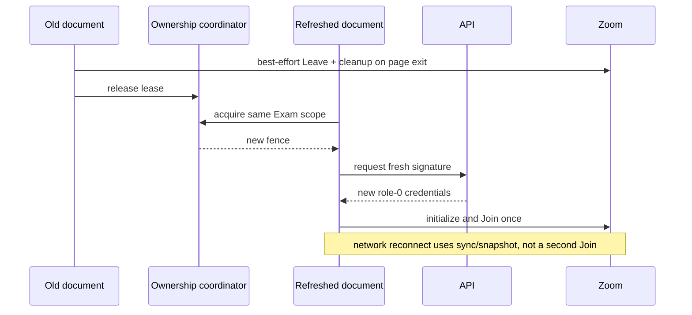

### 10.6 Exam A to Exam B isolation

```mermaid
sequenceDiagram
  participant P as Participant controller
  participant OA as Exam A ownership
  participant OB as Exam B ownership
  participant API as API
  P->>OA: own user:role:exam:A
  P->>API: signature for Exam A
  P->>P: route changes to Exam B; abort A and retire A iframe
  P->>OA: release A
  P->>OB: acquire user:role:exam:B
  P->>API: signature for Exam B
  API-->>P: B credentials
  Note over P,API: late A responses and callbacks are ignored
```

### 10.7 Exam attempt and submission separation

Online Exam meeting entry does not create an MCQ attempt, start an Exam timer, write an answer draft, or submit an Exam. Existing Online Exam upload uses `/exams/:id/submit`, its in-flight fence, 409 idempotency handling, 410 expiry handling, and narrow query reconciliation unchanged. Leave, Zoom End, SDK failure, and reconnect do not submit or erase Exam state.

If product flow submits while a meeting is active, the submission mutation remains authoritative and meeting resources must be retired by the enclosing flow without changing the submitted payload. A failed submission must keep the meeting lifecycle and unsaved Exam state recoverable.

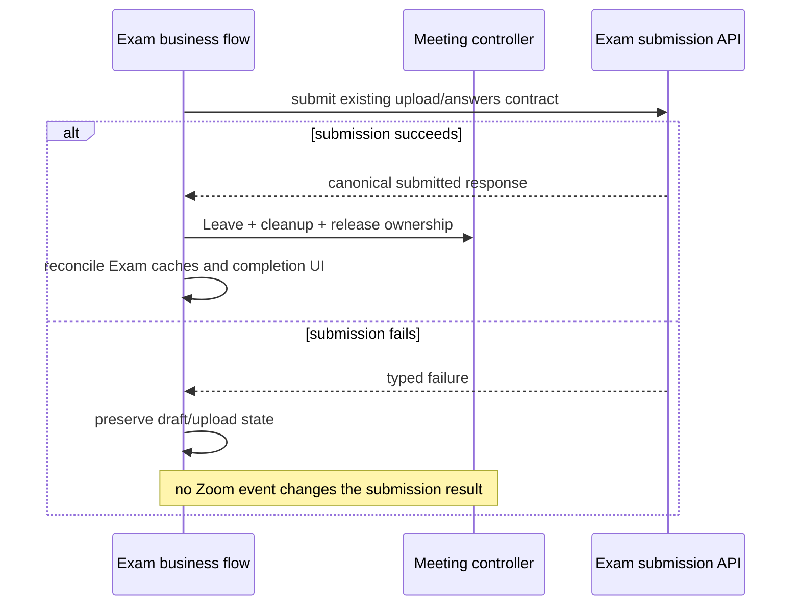

### 10.8 Hostless errors and Leave

`zoom-waiting-for-host` or `zoom-waiting-room` is a Zoom configuration error for an Online Exam. The controller immediately hides/retires the iframe, performs best-effort Leave, releases ownership, and shows translated Retry and Back controls. It never shows “Waiting for the Teacher.”

Student Leave uses `leaveAndRelease`, clears in-memory credentials/permissions, releases ownership, removes the SDK and listeners, and navigates back. It never calls Session End, ends the meeting for others, submits the Exam, or clears answers/drafts.

### 10.9 Flutter WebView authentication

Flutter injects only the normal authenticated frontend state and opens the official frontend route. Flutter never receives or transports Zoom signature, passcode, SDK client ID, permissions, or ZAK. The iframe permission policy remains the browser enforcement point, while native Camera/Microphone grants must also follow the backend role policy.

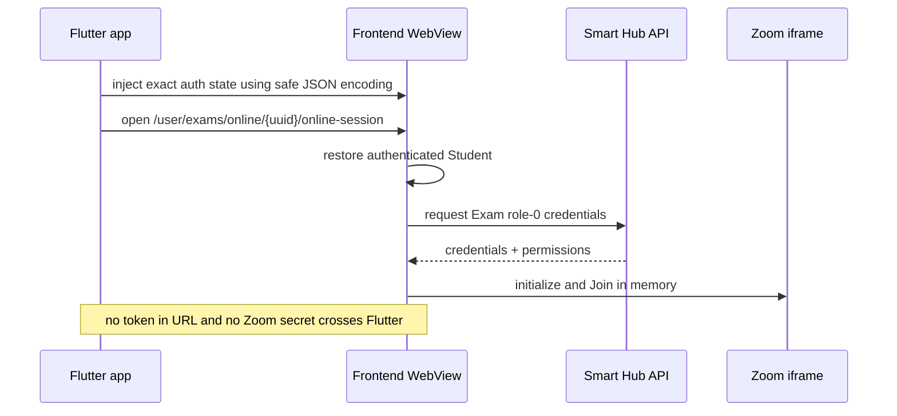

### 10.10 Error classification and tests

The custom shell handles unavailable/unauthorized backend denial, malformed or expired credentials, permission mismatch, SDK initialization/Join/timeout, lifecycle reconciliation, unsupported browser/WebView, network reconnect, ownership conflict/loss, and hostless Waiting Room configuration. Raw backend exceptions and credential-bearing SDK details are never rendered or logged.

Focused coverage lives in the participant controller, credential normalizer, protocol/runtime, active-client coordinator, user route, Exam guard/time/submission, and Session regression suites. Real browser proof still requires a joinable assigned Student Exam plus isolated Assistant/Teacher/Admin profiles; real Flutter device coverage is separate from browser WebView-oriented validation.

### 10.11 File map

- `src/modules/users/exams/pages/online-session/ExamOnlineSessionPage.tsx`: Student route adapter and authoritative Exam guard.
- `src/modules/users/shared/meeting/components/ParticipantMeeting.tsx`: shared Student/Assistant attendee lifecycle, ownership, credential fencing, Exam-specific hostless handling, Leave, and lifecycle UI.
- `src/modules/users/shared/meeting/utils/participant-meeting.helpers.ts`: role-0 JWT/response validation and backend permission normalization.
- `src/modules/shared/meeting/coordination/active-meeting-client.ts`: user + role + subject type + subject ID browser ownership.
- `src/modules/shared/meeting/sdk/zoom-client-view-protocol.ts`: protocol v6 permission-bearing parent-init and Join envelopes.
- `src/modules/shared/zoom/components/ZoomMeetingFrame.tsx`: iframe lifecycle, permission equality guard, and browser permissions policy.
- `src/zoom-client-view/main.ts`: pinned Zoom 6.2.0 Client View runtime and permission-derived SDK configuration.
- `src/modules/users/exams/containers/*` and `hooks/useExamsQueries.ts`: unchanged Exam timer, draft, upload, submission, and cache lifecycle.
- `docs/FLUTTER_WEBVIEW_ONLINE_MEETINGS.md`: WebView authentication, lifecycle, and role permission guidance.
- `docs/ONLINE_EXAMS_MEETING_QA_CHECKLIST.md`: manual role/browser/WebView/Exam regression matrix.

## 11. Unified End

`createEndSessionCoordinator` owns one in-flight Promise. Manual click, scheduled expiry, Zoom-ended, and resume-after-expiry all receive the same Promise. After a failure the latch resets for an explicit retry; after success it stays completed.

Ordering is:

1. enter Ending;
2. request Zoom host-end best-effort;
3. call backend End;
4. retire the iframe and release active-client ownership best-effort;
5. let the owned page validate the End result, update detail/lists monotonically, and invalidate Session lists narrowly;
6. show one success and the custom ended state once.

Backend success wins even if SDK cleanup throws. A successful backend End with a definitively unsent iframe command shows a sanitized warning instead of claiming Zoom confirmation. If both fail, the same scoped coordinator keeps an unsent command eligible for one retry when that iframe becomes ready, while a command already posted is not duplicated. A completed detail is treated as already ended. End does not rely on navigation to reconcile the UI; the iframe is removed and the accessible ended state provides the explicit Back action. Release still requires the backend End implementation to guarantee Zoom termination when the browser command cannot be posted.

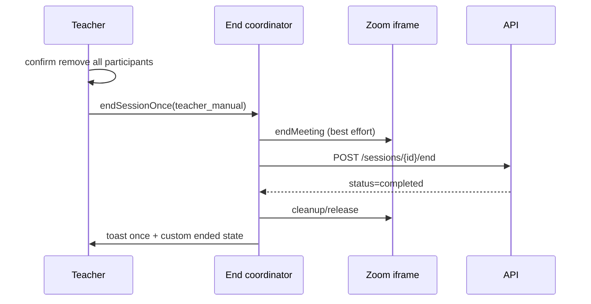

## 12. Scheduled end and warning

`calculateSessionEndAt(dueDateIso, durationMinutes)` parses the API instant with existing date utilities and adds minutes in milliseconds. It never parses a locale string. Starting late does not move the deadline.

The deadline notice component recomputes `endAtMs - Date.now()` every second and on visibility, focus, online, and `smart-hub:webview-resume` events. It keys effects by numeric deadline, preventing a new `Date` object from resetting single-fire guards. Only the small notice component rerenders each second; the host page does not. The visible timer uses authoritative remaining milliseconds and formats `10:00` through `00:00`. The notice opens once, can be dismissed without disabling automatic End, and does not offer Extend.

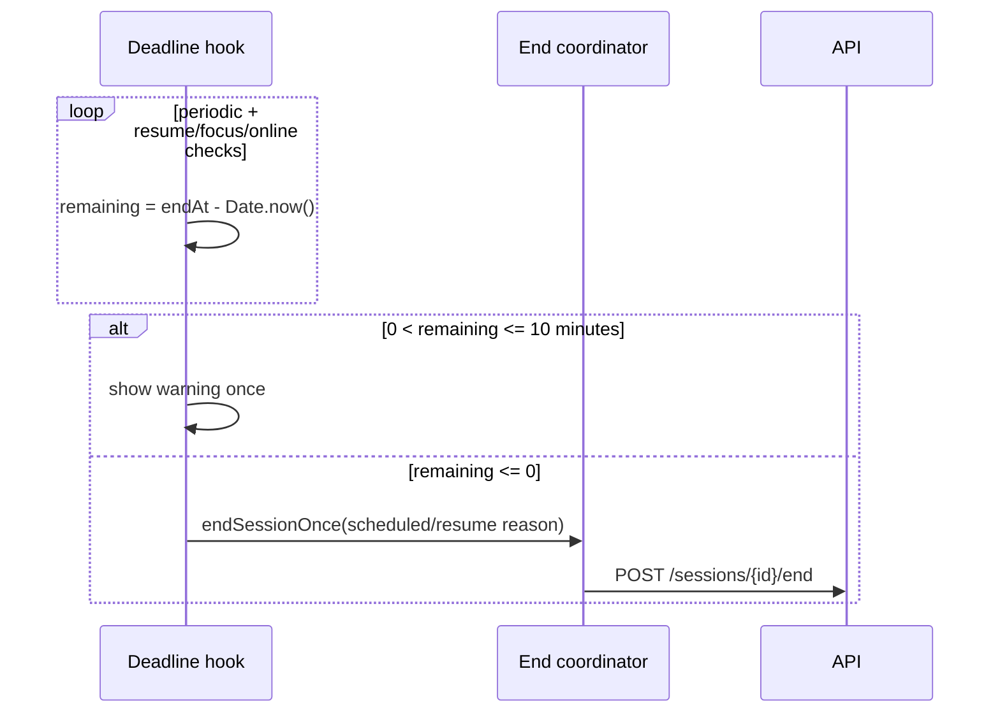

Frontend synchronization is strong only while a host page can execute JavaScript. Closed tabs, terminated WebViews, powered-off devices, and indefinite OS suspension require a backend scheduler/queue that independently finds live Sessions past `due_date + duration` and invokes the same idempotent End domain operation.

## 13. Flutter WebView auth

The exact key is `auth_session`. Its JSON contains `token`, `role`, `portal`, full `user`, and `persistence`. Flutter writes it at document start with nested `jsonEncode`, then opens the role-specific HTTPS path. Credentials come from the backend after web auth restoration.

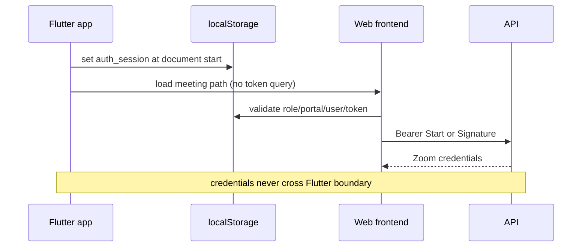

On native resume Flutter dispatches `smart-hub:webview-resume`. It does not call End. See `FLUTTER_WEBVIEW_ONLINE_MEETINGS.md` for complete code.

## 14. Cleanup and security

Lifecycle cleanup aborts credential fetches, clears timers and browser/WebView listeners, retires postMessage attempts, and unmounts the isolated iframe. It does not delete Zoom's shared SDK `localStorage` containers during End, Leave, iframe disposal, app bootstrap, or same-identity auth synchronization: those containers are origin-wide, so one tab could otherwise corrupt another active runtime. The exact allowlisted storage cleanup runs only at a real auth boundary (new login after confirming no existing session, logout/invalid auth, or synchronized identity change) and preserves `auth_session`, locale, theme, Exam timing, active-client coordination records, and unrelated storage. Smart Hub never writes signatures, ZAKs, passcodes, or meeting numbers to either storage API, and there is no credential vault to clear.

Route change, refresh, backgrounding, and transient disconnection do not call backend End. Participant page exit sends SDK Leave best-effort before local retirement. Teacher page exit deliberately performs **local cleanup only**: invoking the host SDK Leave path can end the Zoom meeting for everyone, so only an explicit/coordinated End flow may request host End. Browser unload is best-effort and cannot guarantee that asynchronous SDK work completes; ownership expiry/takeover and server status remain the recovery boundaries.

Never log or persist bearer tokens, signatures, ZAKs, passcodes, or raw response objects. Safe diagnostics are limited to non-secret state/category metadata. Exact-origin/source/nonce/lifecycle/attempt checks defend the iframe channel. Participant iframes have no Camera/Mic/display-capture permission at the browser boundary.

## 15. Query/cache behavior

- Teacher list keys contain all applied filters and use 15-item pages.
- Start/End are mutations, not cached queries.
- Start merges only the returned Session resource, never credentials, using a monotonic detail write.
- Completed is terminal in detail and loaded lists; a late Live response cannot overwrite it.
- Start/End writes reconcile monotonically without discarding newer in-flight reads; Start invalidates its exact detail and lists, while End patches detail/lists immediately, removes mismatched filtered cards, and invalidates only Session lists.
- Participant Signature and URL operations are typed mutations with `gcTime: 0` and no automatic retry.
- Credential responses remain only in the active operation and are reset after mapping; no handoff store exists.
- The one-use Start-intent map contains only a Session ID and expiry, never Zoom credentials.
- An auth-boundary epoch changes before Query cache clear. Teacher Start, recovery, and End writers capture that epoch and reject late prior-identity writes; Student work is fenced by user/role/subject lifecycle, ownership, request sequence, abort, and mounted state.
- TanStack cannot cancel an already executing mutation. Other application modules that do not opt into the epoch remain an app-wide auth-cache hardening concern outside this Online Sessions change; the implementation does not claim a global mutation fence.

## 16. Failure debugging

1. Confirm the role-specific route guard and `auth_session` role/portal pair.
2. Confirm `/zoom-client-view.html` returns the marker meta tag, not the SPA page.
3. Confirm all Zoom assets are version 6.2.0; mixed assets fail closed.
4. Inspect only HTTP status and typed lifecycle category, never response credentials.
5. For participant denial, verify assignment/status/window and the exact false permission object.
6. For host failure, verify Start returns role-1 JWT, ZAK, meeting number, passcode, WebRTC mode, and the requested Session ID.
7. For repeated calls, check React Strict Mode remounts, ownership fences, takeover, lease expiry, and native WebView recreation. One owner and single-flight refs prevent duplicate work; a new owner intentionally fetches fresh credentials.
8. For expiry, compare the API due-date instant plus duration to the platform clock and verify the backend scheduler.

## 17. Test map

- `meeting-lifecycle.test.ts`: legal/illegal transitions.
- `meeting-role-policy.test.ts`: host vs view-only capabilities.
- `meeting-start-intent-vault.test.ts`: one-use, TTL-bound, non-secret Start intent.
- `active-meeting-client.test.ts`: Web Lock and fenced-lease ownership, takeover, expiry, stale fence, and page exit.
- `use-active-meeting-client.test.tsx`: React lifecycle and Strict Mode ownership cleanup.
- `session-deadline.test.ts`: time math and invalid inputs.
- `use-session-deadline.test.tsx`: warning, dismissal, drift/resume, expiry, cleanup, disabled consumers.
- `end-session-coordinator.test.ts`: manual/timer and timer/Zoom races, exact-once stages, retry, and cleanup failure.
- `main.test.ts`: one init/join, view-only SDK flags, exact Session-only permission-notice handling, Exam preservation, host-ended phases, JWT payload handling, event normalization, and shared-storage preservation.
- `ZoomHostMeeting.test.tsx`: exact-origin protocol, nonce/lifecycle/attempt protection, iframe permissions, cleanup.
- `LiveSessionPage.test.tsx`: exact Start-response provenance, mutation retirement, refresh Rejoin, confirmation/End, joined and expired-on-load deadline End, cached-data background-refetch failure, resume-to-completed reconciliation, role CTA, ownership/lifecycle/auth-epoch changes, A-to-B credential fencing, stable coordinator identity, unsent SDK End recovery, monotonic fallback, retired callbacks, and deferred End success/failure.
- `ParticipantMeeting.test.tsx`, `StudentSessionTerminalState.test.tsx`, and `participant-meeting-cache.helpers.test.ts`: preflight denial without an iframe, exact role-0 Signature provenance, immediate mutation reset, waiting/admission, one-time accessible remote-End popup, persistent same-lifecycle no-live state, narrow Home reconciliation, duplicate terminal idempotence, Session A-to-B fencing with exact-frame Leave, genuine-unmount/Strict-Mode behavior, one-step ownership recovery, controlled Leave races, fresh Exam retry, and Exam regression boundaries.
- `useHome.test.tsx`: invalidated Student Home refetches on the next mount while Parent Home keeps its existing mount behavior.
- `useParticipantMeetingCredentials.test.tsx`, `meeting-storage-cleanup.test.ts`, and `auth.meeting-credentials.test.ts`: one-use mutation eviction plus tab-local and true auth-boundary storage cleanup.
- `teacher-session-queries.test.tsx` and cache/mutation integration tests: monotonic detail/list reconciliation, list-only newer state, Start-versus-completed ordering, focus/reconnect/remount, and AbortSignal propagation.
- `participant-meeting-pages.test.tsx`: Session and Exam adapters plus invalid route.

## 18. Current verification status (2026-08-06)

Browser evidence is still **Student-only and not release acceptance**:

- An authenticated Student Chrome context reached the live Session view with two observed participant tiles.
- A second tab in the same browser profile showed the ownership-conflict state before meeting initialization.
- The live view exposed Zoom's capture-permission notice, which motivated the pinned 6.2.0 workaround above.
- A completed Student hard refresh reached the generic not-joinable error because the Signature contract has no stable completed discriminator.
- After the preflight change, the same denied Student route showed the custom not-joinable state with zero iframes. This proves denial-before-initialization only; it does not prove a completed-specific Ended state.

No authenticated Admin or Teacher context, post-change full-role flow, manual or automatic End, second Session, roster reconciliation, backend scheduler, or Android/iOS WebView run has passed. Screenshots containing visible account/participant names are not sanitized release evidence and must not be published without approved redaction. The Student completed-refresh contract blocker above is unresolved. These gaps prevent a production-ready E2E claim.

For manual browser/WebView coverage, use `ONLINE_MEETINGS_QA_CHECKLIST.md`.
