# دليل تكامل جلسات المعلم مع Zoom

> مرجع تعليمي وتشغيلي مبني على الكود الحالي بتاريخ 6 أغسطس 2026.
>
> يشرح هذا الدليل ما يفعله التطبيق فعلًا، ولا يفترض أن اختبار اجتماع Zoom حقيقي أو مقارنة A/B أو اختبار WebView قد نُفّذ. وجود اختبار آلي في المستودع لا يساوي نجاح اجتماع حقيقي. حالة الأدلة الفعلية موضحة في الفصل 20، بما فيها إعادة إنتاج Chrome السابقة للتعديل وما بقي غير مكتمل بعده.

## 1. ما الذي نبنيه؟

نبني صفحة جلسة تعليمية مباشرة داخل منصة إدارة التعلّم، ويُشار إليها اختصارًا بـLMS. يفتح المعلم قائمة جلساته، ثم ينتقل إلى صفحة الجلسة الحية ويبدأ اجتماع Zoom أو يعيد الانضمام إليه، بينما يظل رأس المنصة والشريط الجانبي ظاهرين.

إظهار Zoom داخل المنصة له فوائد مباشرة:

- لا يضيع المعلم بين نافذة المنصة وموقع آخر.
- تظل أدوات التنقل وهوية المنصة وسياق الجلسة ظاهرة.
- تبقى المنصة هي صاحبة قرار البدء والإنهاء ومزامنة حالة الجلسة.
- لا يوجد تحويل إلى `zoom.us`، ولا تبويب جديد، ولا صفحة Zoom مستقلة تنافس صفحة المنصة.

اختير **Client View**، أي واجهة اجتماع Zoom الكاملة التي يديرها Meeting SDK، داخل `iframe` معزول. هذا مناسب للحالة الحالية لأن المطلوب تجربة الاجتماع الكاملة مع بقاء App Shell، أي غلاف المنصة الذي يضم الرأس والشريط الجانبي، ظاهرًا حولها. لا يستخدم المشروع Component View، ولا يدمج Zoom مباشرة داخل حزمة React 19.

الصورة النهائية المقصودة هي:

```text
React 19 LMS
├── غلاف المعلم: الرأس + الشريط الجانبي
├── قائمة الجلسات
├── صفحة الجلسة الحية
├── طلبات details/start/end
└── iframe من نفس الأصل
    └── Zoom Meeting SDK Web Client View 6.2.0
```

## 2. أساسيات الويب من الصفر

### المتصفح والصفحة

**المتصفح Browser** برنامج مثل Chrome أو Edge يعرض صفحات الويب. **الصفحة Page** مستند يصل من الخادم ثم يفسره المتصفح.

تتكون الصفحة عادة من:

- **HTML**: يحدد الهيكل، مثل عنوان وزر ومنطقة اجتماع.
- **CSS**: يحدد الشكل، مثل اللون والحجم والمسافة.
- **JavaScript**: ينفذ السلوك، مثل الاستجابة للنقر وإرسال طلب.
- **React**: مكتبة JavaScript تبني الواجهة من مكوّنات صغيرة وتعيد عرض الجزء الذي تغير.

### Frontend وBackend

**Frontend** أو الواجهة الأمامية هو الكود الذي يعمل في المتصفح ويراه المستخدم. **Backend** أو الواجهة الخلفية هو الكود الذي يعمل على الخادم، يصل إلى قاعدة البيانات، ويتخذ القرارات التي لا يجوز الوثوق بالمتصفح لتنفيذها.

في هذا التكامل:

- React وقائمة الجلسات وصفحة الجلسة الحية هي Frontend.
- إنشاء توقيع Zoom، تحديد صلاحية المعلم، وبدء/إنهاء الجلسة هي مسؤوليات Backend.

### API وHTTP

**API** عقد منظم يسمح للواجهة بطلب بيانات أو تنفيذ فعل من الخادم. يستخدم المشروع بروتوكول **HTTP**، وهو قواعد إرسال الطلبات والردود عبر الويب.

- **Request**: الطلب الخارج من المتصفح، مثل «أعطني تفاصيل الجلسة».
- **Response**: رد الخادم، مثل بيانات الجلسة أو رسالة خطأ.
- `GET`: قراءة بيانات دون طلب تغييرها.
- `POST`: طلب تنفيذ فعل، مثل بدء جلسة أو إنهائها.

طلبات هذه الوحدة هي:

```text
GET  /sessions
GET  /sessions/:id
POST /sessions/:id/start
POST /sessions/:id/end
```

### Authentication وAuthorization

**Authentication، المصادقة** تجيب: من أنت؟  
**Authorization، التفويض** يجيب: ماذا يسمح لك أن تفعل؟

بعد تسجيل الدخول، تملك المنصة **Bearer token**، وهو نص سري يثبت للخادم أن الطلب تابع للمستخدم المسجل. يضيف عميل `$http` هذا النص إلى ترويسة HTTP:

```text
Authorization: Bearer <token>
```

لا يذهب Bearer token إلى iframe، ولا يحتاج Zoom إليه. كذلك تحمي المسارات الصفحة بدور `teacher`، لكن حماية الواجهة ليست بديلًا عن تحقق الخادم من الصلاحيات.

## 3. مفاهيم Zoom

### Meeting SDK وClient View

**Zoom Meeting SDK** مكتبة رسمية تسمح لتطبيق ويب بالانضمام إلى اجتماع Zoom من داخل التطبيق.

- **Client View**: واجهة Zoom الكاملة التي ينشئها SDK داخل الصفحة.
- **Component View**: مكوّنات أصغر يركبها التطبيق داخل تصميمه. هذا المشروع لا يستخدمه.

المشروع يثبت Client View على الإصدار `6.2.0`.

### المضيف والمشارك

- **Host، المضيف** يملك صلاحيات إدارة الاجتماع.
- **Participant، المشارك** ينضم دون صلاحيات المضيف.
- الحقل `role: 1` داخل توقيع Meeting SDK يعني دور المضيف في هذا التدفق.
- `role: 0` يعني مشاركًا، وليس هو الدور المقبول لصفحة المعلم الحالية.

### Meeting number وPasscode

**Meeting number** رقم يحدد اجتماع Zoom.  
**Passcode** كلمة مرور الاجتماع إن وُجدت.

الكود الحالي يستقبل `meeting_number` و`meeting_passcode` من `/start` ويرسلهما إلى SDK باسمَي `meetingNumber` و`passWord`. يرفض التحقق القيم الناقصة أو الفارغة، وتبقى كلمة المرور في الذاكرة المؤقتة فقط ولا تُحفظ في التخزين أو عنوان الصفحة.

### Signature وJWT

**JWT** نص مكوّن من ثلاثة أجزاء مفصولة بنقاط. يحمل Claims، أي حقولًا مثل رقم الاجتماع والدور ووقت الانتهاء، ثم يوقعه الخادم تشفيريًا.

**Meeting SDK Signature** هو JWT موقّع يسمح لـSDK باستخدام اجتماع محدد ودور محدد خلال مدة محددة. الواجهة الحالية تفك ترميز الجزء الذي يحتوي Claims للتحقق من الشكل والقيم والحداثة، لكنها لا تنشئ التوقيع ولا تعدله ولا تستطيع إثبات صحته تشفيريًا دون سر الخادم.

### ZAK

**ZAK، Zoom Access Key** اعتماد مؤقت خاص بالمضيف. يحتاجه تدفق انضمام المعلم بصفته Host. يجب طلبه حديثًا وعدم تخزينه.

### WebRTC وWebAssembly

- **WebRTC** تقنيات المتصفح للصوت والفيديو والاتصال المباشر في الزمن الحقيقي.
- **WebAssembly أو WASM** صيغة سريعة يشغلها المتصفح؛ يستخدم Zoom ملفات صوت وفيديو مثل `audio.simd.wasm` و`video.simd.wasm`.
- نجاح تحميل WASM يثبت أن مرحلة تحميل هذه الملفات نجحت فقط، ولا يثبت أن `init` أو `join` أو الانتقال إلى اجتماع متصل قد نجح.

### SharedArrayBuffer وGallery View

**SharedArrayBuffer** مساحة ذاكرة مشتركة بين مهام المتصفح، وقد تتطلب سياسات عزل مثل COOP وCOEP. هذا التكامل لا يضيف SharedArrayBuffer أو COOP أو COEP.

**Gallery View** عرض عدة مشاركين في شبكة. الرسالة القديمة `Gallery View Not Supported` تعامل كتحذير غير قاتل؛ لا تحول الحالة إلى فشل.

### `video_webrtc_mode: 1`

الخادم يضيف الحقل الرقمي التالي قبل توقيع JWT:

```json
{
  "video_webrtc_mode": 1
}
```

يتحقق Frontend من أن القيمة رقم صحيح يساوي `1`، وليس النص `"1"`. لكنه لا يضيف هذا الحقل إلى `ZoomMtg.init` أو `ZoomMtg.join`، ولا يعيد توقيع JWT، ولا يعدله. أي تغيير في جزء JWT بعد التوقيع يفسد التوقيع؛ لذلك مصدره الوحيد هو Backend.

يتحقق الكود الحالي أيضًا من:

- `role` رقم يساوي `1`.
- `mn` يطابق `meeting_number`.
- `iat` و`exp` و`tokenExp` أعداد صحيحة وفي ترتيب زمني صالح.
- لم يتبق أقل من 30 ثانية على `exp` أو `tokenExp`.
- `iat` ليس في المستقبل بأكثر من سماح قدره 60 ثانية.

## 4. لماذا عُزل React 19 عن Zoom؟

تعمل المنصة الرئيسية بـReact 19. أما نسخة Client View المحملة من CDN فتجلب داخل مستندها المعزول نسخ React وReactDOM واعتماديات أخرى يحتاجها Zoom 6.2.0. تحميل البيئتين في المستند نفسه قد يصنع تعارضًا في globals أو DOM أو CSS أو lifecycle.

الحل هو **iframe**: عنصر HTML يعرض مستندًا ثانيًا داخل المستند الأول. المستندان هنا من **نفس الأصل Same origin**، أي لهما البروتوكول والمضيف والمنفذ أنفسهم، مثل:

```text
https://lms.example/dist/index.html
https://lms.example/dist/zoom-client-view.html
```

العزل يحقق الآتي:

- حزمة React 19 لا تحمل Zoom SDK.
- iframe لا يحمل مدخل React الرئيسي `src/main.tsx`.
- CSS الخاص بـZoom لا يلوث CSS المنصة، والعكس.
- iframe لا يقرأ Zustand أو Bearer token أو React Query.
- iframe لا يستدعي `/sessions` أو `/start` أو `/end`.
- الأب React وحده يملك API والتنقل والترجمة.
- iframe وحده يملك `ZoomMtg` وتهيئة SDK والانضمام ومراقبة حالة Zoom.

كون iframe من نفس الأصل لا يعني إعطاءه كل المسؤوليات. العزل هنا حد معماري
وفصل لمسؤوليات التنفيذ، لكنه **ليس حدًا أمنيًا صلبًا**: كود iframe الذي نملكه
لا يقرأ Bearer ولا يستدعي LMS API، بينما يستطيع كود الطرف الثالث داخل إطار
same-origin غير sandboxed الوصول تقنيًا إلى parent والتخزين المشترك.

## 5. المعمارية الكاملة

```mermaid
flowchart LR
    T[المعلم]
    R[React 19 Teacher App Shell]
    L[قائمة الجلسات]
    P[صفحة الجلسة الحية]
    O[منسق العميل النشط]
    Q[React Query]
    H[عميل HTTP مع Bearer token]
    B[Backend LMS]
    ZB[Backend Zoom signing]
    F[Same-origin iframe]
    Z[Zoom Meeting SDK Client View 6.2.0]
    C[Zoom CDN وWASM]

    T -->|يفتح ويتفاعل| R
    R --> L
    R --> P
    P -->|ملكية Session بسياج| O
    O -->|يسمح لمالك واحد فقط| P
    L -->|قراءة أو Start/End حضوري| Q
    P -->|Details وStart/Rejoin وEnd| Q
    Q --> H
    H -->|HTTP آمن| B
    B -->|ينشئ Signature وZAK| ZB
    ZB --> B
    B -->|بيانات جلسة واعتمادات مؤقتة| P
    P -->|postMessage بعد الجاهزية| F
    F --> Z
    Z -->|يحمل أصول الإصدار المثبت| C
    F -->|حالات آمنة بلا أسرار| P
```



شرح الصناديق والأسهم:

1. المعلم يتعامل مع App Shell؛ لذلك يبقى الرأس والشريط الجانبي ظاهرين.
2. القائمة والصفحة الحية مساران داخل App Shell نفسه.
3. React Query ينظم قراءة التفاصيل وتنفيذ mutations وتحديث cache.
4. `$http` يضيف Bearer token ويرسل الطلب إلى Backend؛ iframe غير موجود في هذا السهم.
5. Backend يولد Signature وZAK. مفتاح التوقيع السري لا يصل إلى Frontend.
6. قبل إنشاء iframe أو طلب `/start`، تكتسب الصفحة ملكية العميل النشط لنفس المستخدم + الدور + Session؛ Web Lock هو المسار المفضل، والبديل lease مسيّج ذو heartbeat.
7. `/start` يعيد اعتمادًا حديثًا إلى الصفحة الأم المالكة فقط، وتُرفض الاستجابة المتأخرة إذا تغير سياج الملكية.
8. بعد جاهزية المستند الصحيح، ترسل الصفحة أمر انضمام واحدًا إلى iframe عبر `postMessage`.
9. iframe يشغل SDK المثبت ويحمل ملفات 6.2.0 من CDN.
10. iframe يعيد أحداث حالة مصنفة، مثل `zoom-joined` أو `zoom-join-error`، دون Bearer token أو stack trace أو الاعتمادات الكاملة.

حدود المسؤولية:

| الطبقة       | ما تملكه                                                     | ما لا تملكه                                 |
| ------------ | ------------------------------------------------------------ | ------------------------------------------- |
| Backend      | التفويض، حالة الجلسة، التوقيع، ZAK، `/start`، `/end`         | عرض واجهة Zoom داخل المتصفح                 |
| React parent | المسارات، API، cache، ملكية العميل، واجهة الحالات، الاستعادة | تشغيل `ZoomMtg` مباشرة                      |
| iframe       | CDN، `init`، `join`، أحداث Zoom، timers، cleanup المحلي      | Bearer token أو LMS API أو تخزين الاعتمادات |

## 6. دليل ملفًا بملف

### مداخل البناء والنشر

| الملف                             | المسؤولية والاستيراد/التصدير                                                                   | الدخل والخرج                                | لماذا يوجد؟                             | ما الذي يجب ألا يفعله؟                                        |
| --------------------------------- | ---------------------------------------------------------------------------------------------- | ------------------------------------------- | --------------------------------------- | ------------------------------------------------------------- |
| `package.json`                    | يثبت React 19 وVite وVitest وReact Query وأوامر Yarn؛ لا يحتوي حزمة Zoom npm                   | أوامر مثل `yarn build`؛ ينتج build أو tests | يجعل Zoom خارج الحزمة الرئيسية          | لا يغير React أو SDK بلا مراجعة                               |
| `yarn.lock`                       | يقفل نسخ حزم المشروع                                                                           | مدخل Yarn؛ شجرة اعتماديات ثابتة             | بناء قابل للتكرار                       | لا يعاد توليده بـnpm                                          |
| `index.html`                      | مدخل تطبيق LMS ويحمل `/src/main.tsx`                                                           | ينتج `dist/index.html`                      | مستند React الرئيسي                     | لا يحمل سكربت Zoom                                            |
| `zoom-client-view.html`           | مستند iframe ذو marker؛ يحمل CSS/vendor/SDK 6.2.0 بالترتيب ثم `src/zoom-client-view/main.ts`   | ينتج `dist/zoom-client-view.html`           | عزل Client View                         | لا يحمل `src/main.tsx` أو Bearer token                        |
| `vite.config.ts`                  | يحدد alias والاختبارات ومدخلي Rollup و`base`؛ يصدّر Vite config                                | `serve`: `/`، build/preview: `/dist/`       | يصدر المستندين ويصحح مسارات الإنتاج     | لا يجعل SPA المدخل الوحيد                                     |
| `.htaccess`                       | يخدم ملفًا موجودًا تحت `/dist/` قبل SPA fallback ويحدد cache headers                           | URL؛ ملف حقيقي أو `/dist/index.html`        | يمنع استبدال iframe بالـSPA             | لا يعيد كتابة `dist/zoom-client-view.html` إلى `index.html`   |
| `src/zoom-client-view/styles.css` | يثبت أبعاد الصفحة والجذر ويعرض حالة تحميل مقروءة                                               | CSS داخل iframe                             | يمنع جذرًا صفري الأبعاد وشاشة غير مفسرة | لا يؤثر في App Shell                                          |
| `src/zoom-client-view/main.ts`    | يستورد البروتوكول والثوابت ومصنفات الأخطاء؛ يصدّر `disposeZoomClientViewRuntime` ويشغل runtime | أوامر parent؛ أحداث typed إلى parent        | المصدر الوحيد لتشغيل `ZoomMtg`          | لا يستدعي LMS API، لا يسجل الأسرار، لا ينشئ أكثر من init/join |

### نموذج البيانات وAPI وReact Query

| الملف                                       | المسؤولية والاستيراد/التصدير                                                  | الدخل والخرج                                   | لماذا يوجد؟                                                 | ما الذي يجب ألا يفعله؟                              |
| ------------------------------------------- | ----------------------------------------------------------------------------- | ---------------------------------------------- | ----------------------------------------------------------- | --------------------------------------------------- |
| `types/teacher-session-types.ts`            | يصدّر أنواع الجلسة والقائمة والتفاصيل واستجابة البدء واعتمادات المضيف         | أشكال TypeScript                               | مصدر الأنواع المشترك                                        | لا ينفذ شبكة أو UI                                  |
| `schema/teacher-session-response.schema.ts` | يستورد Zod والأنواع؛ يصدّر schemas وparsers                                   | `unknown` من الشبكة؛ بيانات typed أو Zod error | رفض الردود المشوهة مبكرًا                                   | لا يصلح سرًا ناقصًا أو يخمنه                        |
| `services/getTeacherSessions.ts`            | يستورد `$http` وparser؛ يصدّر `getTeacherSessions`                            | page/search؛ قائمة موثقة                       | عزل endpoint عن UI                                          | لا يدير cache                                       |
| `services/getTeacherSessionDetails.ts`      | يصدّر `getTeacherSessionDetails`                                              | session id؛ details                            | قراءة التفاصيل بعد ترميز id                                 | لا يبدأ أو ينهي جلسة                                |
| `services/startTeacherSession.ts`           | يصدّر `startTeacherSession`                                                   | session id؛ عقد online أو offline              | نقطة `/start` الوحيدة                                       | لا يخزن Signature/ZAK                               |
| `services/endTeacherSession.ts`             | يصدّر `endTeacherSession`                                                     | session id؛ جلسة بعد الإنهاء                   | نقطة `/end` الوحيدة                                         | لا يستدعي SDK                                       |
| `constants/teacher-sessions-query-keys.ts`  | يصدّر شجرة query keys                                                         | params/id؛ مفاتيح ثابتة                        | يمنع مفاتيح cache متنافسة                                   | لا يضع الاعتمادات في المفتاح                        |
| `hooks/useGetTeachersSessions.ts`           | يستورد الاستعلام اللانهائي وquery context؛ يصدّر hook القائمة                 | search؛ صفحات، stats، حالات التحميل            | pagination وinfinite scroll                                 | لا يحمل Zoom                                        |
| `hooks/useGetTeacherSessionDetails.ts`      | يمرر AbortSignal ويعيد التحقق عند mount/focus/reconnect ويدمج status رتيبًا   | id اختياري؛ query state                        | يجعل الخادم سلطة الصفحة ويمنع إحياء completed               | لا يعمل عند id غير صالح                             |
| `hooks/useStartTeacherSession.ts`           | mutation خام بـ`gcTime: 0` بلا cache side effects؛ الصفحة تملك commit المسوّر | id؛ Start response transient                   | يمنع hook من كتابة رد lifecycle قديم                        | لا يضع Signature/ZAK في query cache                 |
| `hooks/useEndTeacherSession.ts`             | mutation خام؛ الصفحة تملك التحقق والدمج الرتيب خلف scope وauth epoch          | id؛ session resource                           | يمنع رد مستخدم/مسار قديم من إعادة ملء cache                 | لا يقرر completed أو يبطل query منفردًا             |
| `utils/teacher-session.helpers.ts`          | يصدّر تطبيع id ودمج details والتحقق من credentials/JWT                        | id أو رد `/start`؛ قيمة آمنة أو `null`         | بوابة الاعتمادات قبل iframe                                 | لا يتحقق تشفيريًا أو يعدل JWT                       |
| `utils/teacher-session-cache.helpers.ts`    | يصدّر دمجًا رتيبًا وكتابة detail/list لكل cache محمل                          | session resource؛ cache updates                | يجعل `completed` terminal ويحذف البطاقة من filter غير مطابق | لا يخزن credentials أو ينشئ status                  |
| `zoom/zoom-meeting-sdk-jwt.ts`              | يصدّر فاحص Claims محدودًا                                                     | Signature + meeting number + الوقت؛ inspection | يفحص الدور والحداثة والحقل الجديد دون تسجيل JWT             | لا ينشئ توقيعًا ولا يدعي cryptographic verification |

### القائمة والمسارات

| الملف                                            | المسؤولية والاستيراد/التصدير                                                   | الدخل والخرج                               | لماذا يوجد؟                              | ما الذي يجب ألا يفعله؟                        |
| ------------------------------------------------ | ------------------------------------------------------------------------------ | ------------------------------------------ | ---------------------------------------- | --------------------------------------------- |
| `utils/get-teacher-session-capabilities.ts`      | يصدّر مصفوفة الأفعال من type/status                                            | جلسة مختصرة؛ capabilities                  | مصدر حقيقة لسلوك البطاقات                | لا ينفذ الفعل                                 |
| `utils/teacher-session-routes.ts`                | يستورد `buildPortalPath`؛ يصدّر مساري القائمة والحي                            | portal/id؛ URL                             | يمنع hardcoded routes                    | لا يضع credential في URL                      |
| `page/SessionPage.tsx`                           | يجمع header/stats/search/list/dialog داخل QueryProvider                        | query context؛ صفحة                        | منسق القائمة                             | لا يكرر mutation logic                        |
| `containers/useZoomSessionsPageActions.ts`       | يجلب details authoritative ثم يكتب cache وينشئ Start intent غير سري عند الحاجة | نقرة؛ تنقل أو `/start` حضوري أو dialog/end | يمنع stale Rejoin والنقرات المتزامنة     | لا يطلب credentials لجلسة Online من البطاقة   |
| `coordination/meeting-start-intent-vault.ts`     | يخزن Session ID + expiry وراء lifecycle ID لمرة واحدة فقط                      | lifecycle/subject؛ Boolean عند consume     | ينقل نية البدء لا الاعتمادات             | لا يخزن Signature/ZAK/passcode/meeting number |
| `components/organism/ListZoomSessions.tsx`       | يستورد البطاقة والحالة الفارغة؛ يصدّر grid                                     | sessions وpending id؛ بطاقات               | عرض list فقط                             | لا يستدعي API                                 |
| `components/molecules/ZoomSessionCard.tsx`       | يستورد capabilities وعناصر العرض؛ يصدّر بطاقة                                  | TeacherSession؛ أزرار مناسبة               | UI دلالي وحالة pending لكل بطاقة         | لا يقرر قواعد جديدة خارج helper               |
| `components/molecules/ZoomSessionEmptyState.tsx` | يصدّر empty/filtered state                                                     | filtered + reset callback                  | reset يظهر فقط مع filter                 | لا يعدل query مباشرة                          |
| `components/molecules/TeacherSessionsStates.tsx` | يصدّر skeleton وأخطاء القائمة/load-more                                        | query flags؛ UI accessible                 | يمنع شاشة صامتة ونصًا عارضًا في skeleton | لا ينفذ fetch                                 |
| `components/organism/ZoomStatisticsSection.tsx`  | يصدّر بطاقات الإحصاءات                                                         | `SessionExtra` اختياري؛ أرقام              | فصل الإحصاءات عن query                   | لا يجلب البيانات                              |
| `components/molecules/EndSessionDialog.tsx`      | يصدّر AlertDialog مترجمًا                                                      | session/pending/callbacks؛ تأكيد أو إلغاء  | تأكيد واضح ومنع الإغلاق أثناء الطلب      | لا ينفذ `/end` بذاته                          |

### الصفحة الحية وبروتوكول Zoom

| الملف                                     | المسؤولية والاستيراد/التصدير                                                    | الدخل والخرج                                    | لماذا يوجد؟                                                 | ما الذي يجب ألا يفعله؟              |
| ----------------------------------------- | ------------------------------------------------------------------------------- | ----------------------------------------------- | ----------------------------------------------------------- | ----------------------------------- |
| `page/LiveSessionPage.tsx`                | ينسق status authoritative وملكية العميل وstart/end وiframe والـrecovery المحدود | route id + user + frame events؛ UI/API commands | state machine الأب والسياج وcustom ended                    | لا يشغل `ZoomMtg` أو يعرض stack خام |
| `components/organism/ZoomHostMeeting.tsx` | يصدّر iframe وhandle typed للـjoin/leave/end/cleanup/sync/reload                | props/events؛ أوامر versioned                   | يتحقق من document/origin/source/loadNonce/lifecycle/attempt | لا يطلب API ولا يستخدم `*`          |
| `zoom/zoom-client-view-protocol.ts`       | يصدّر الأنواع والمصانع وruntime validators                                      | unknown message؛ typed command/event أو رفض     | عقد الاتصال الوحيد؛ بروتوكول v3 يفرض loadNonce              | لا يقبل payload ناقصًا              |
| `zoom/zoom-client-view-runtime.ts`        | يصدّر فاحص host-end/connected/error/root helpers                                | payload/error/root؛ boolean أو DOM effect       | يعزل magic codes والتصنيف                                   | لا ينفذ API أو state React          |
| `zoom/zoom-client-view-url.ts`            | يصدّر filename وmarker وpath/url builders                                       | Vite base/origin؛ URL same-origin               | مسار صحيح في dev و`/dist/`                                  | لا يضيف query/hash                  |
| `constants/zoom.constants.ts`             | يصدّر `6.2.0` وlib URL وpasscode الحالي                                         | ثوابت؛ قيم موحدة                                | منع تكرار نسخة SDK/lib                                      | لا يخفي version مختلفًا             |
| `locale/ar.json` و`locale/en.json`        | تصدّران النصوص المترجمة المتناظرة                                               | translation key؛ نص                             | حالات فشل مميزة بالعربية والإنجليزية                        | لا تعرض credentials أو stack        |

### ملكية العميل والحالات المشتركة

| الملف                                       | المسؤولية                                                             | الحد الذي لا يتجاوزه                            |
| ------------------------------------------- | --------------------------------------------------------------------- | ----------------------------------------------- |
| `coordination/active-meeting-client.ts`     | Web Lock حصري، أو lease مسيّج في storage مع heartbeat ورسائل takeover | لا يضع أي credential في lock/lease/channel      |
| `coordination/use-active-meeting-client.ts` | يربط controller بدورة React وStrict Mode ويعرض owner/conflict/lost    | لا يمنح صلاحية Backend ولا يتجاوز status الخادم |
| `components/MeetingOwnershipState.tsx`      | حالة وصول/تعارض/Take Over مترجمة وقابلة للكيبورد                      | لا ينشئ iframe أو يطلب Start                    |
| `components/MeetingEndedState.tsx`          | ended UI مخصص ينقل focus ويعرض Back صريحًا                            | لا يعتمد على navigation لإزالة iframe           |

### الملفات المشتركة المرتبطة

| الملف                                              | دوره في التكامل                                                | الحد الذي لا يتجاوزه                |
| -------------------------------------------------- | -------------------------------------------------------------- | ----------------------------------- |
| `src/modules/teachers/routes/routes.tsx`           | يحمل الصفحتين lazy ويحميهما بدور teacher داخل `TeachersLayout` | لا يحمّل Zoom في route القائمة      |
| `src/modules/teachers/layout/TeachersLayout.tsx`   | يبقي App Shell و`main` وskip link حول `Outlet`                 | لا يختفي في الصفحة الحية            |
| `src/store/auth.ts`                                | يوفر teacher identity وportal وtoken للأب                      | iframe لا يستورده                   |
| `src/config/axios.helpers.ts` و`src/utils/http.ts` | يضيفان Bearer token واللغة لطلبات الأب                         | لا يستخدمان داخل iframe             |
| `src/lib/react-query/query-client.ts`              | يحدد stale/cache/retry العامة؛ mutations بلا retry تلقائي      | لا يعيد `/start` أو `/end` تلقائيًا |
| `src/hooks/queries/useInfinitePaginatedQuery.ts`   | يدعم صفحات القائمة وحساب الصفحة التالية                        | لا يعرف Zoom                        |

ملفات الاختبار ليست runtime production، لكنها توثق العقود. تغطي ملفات `*.test.ts(x)` في مجلدي `session` و`src/zoom-client-view` الخدمات وZod والمفاتيح والدمج والقائمة والصفحة الحية والبروتوكول والأصل/المصدر والـtimers والإصدار والبناء والأمن والترجمة. الفصل 20 يوضح الفرق بين هذه التغطية وبين التحقق الحقيقي.

## 7. دورة حياة قائمة الجلسات

القائمة تستخدم `GET /sessions?page=...&search=...` وتعرض إحصاءات وصفحات إضافية. يحدد `getTeacherSessionCapabilities` الأفعال:

| نوع الجلسة | الحالة    | ما يظهر                | ما يحدث                                                    |
| ---------- | --------- | ---------------------- | ---------------------------------------------------------- |
| Online     | Upcoming  | بدء الجلسة المباشرة    | الانتقال إلى الصفحة الحية؛ لا تُطلب credentials من البطاقة |
| Online     | Live      | إعادة الانضمام + إنهاء | فتح الصفحة الحية لإعادة الانضمام، أو dialog ثم `/end`      |
| Offline    | Upcoming  | بدء الجلسة             | `/start` مباشرة؛ لا iframe                                 |
| Offline    | Live      | إنهاء                  | dialog ثم `/end`                                           |
| أي نوع     | Completed | لا فعل                 | عرض فقط                                                    |

نقاط مهمة:

- تنفذ نقرة Online force-fetch لـ`GET /sessions/:id` قبل التنقل؛ فإذا أعاد الخادم Offline أو Completed لا تفتح الغرفة.
- القائمة لا تستدعي `/start` لجلسة Online ولا تستقبل أي Signature/ZAK.
- Upcoming Online ينشئ نية بدء قصيرة العمر ولمرة واحدة تحتوي Session ID فقط؛ state المسار يحمل lifecycle ID معتمًا، لا credential handoff.
- Live Online ينتقل بلا نية بدء؛ الغرفة تعيد قراءة details ثم تطلب `/start` بعد امتلاك العميل وجاهزية runtime.
- `completed` terminal داخل cache: رد Live متأخر لا يعيد إحياء جلسة أنهتها استجابة أحدث.
- pending state ترتبط بمعرف الجلسة؛ لا تتعطل كل البطاقات بصريًا.
- refs تمنع تزامن Start وEnd وتمنع النقر المكرر أثناء العملية.
- زر Reset Filters يظهر فقط عند وجود `search` فعلي.
- skeleton لا يحتوي علامات ترقيم ظاهرة بالخطأ.
- وصف البطاقة يستخدم عناصر inline صالحة ولا يضع block داخل paragraph.
- Zoom assets لا تحمل في القائمة.

## 8. دورة البدء Start

```mermaid
sequenceDiagram
    actor Teacher as المعلم
    participant Parent as React LiveSessionPage
    participant Details as React Query
    participant Owner as Active-client ownership
    participant Frame as Same-origin iframe
    participant SDK as Zoom SDK 6.2.0
    participant API as LMS Backend

    Parent->>Details: GET /sessions/:id
    Details-->>Parent: online + upcoming/live
    Parent->>Owner: acquire(user + role + session)
    Owner-->>Parent: owner fence
    Parent->>Frame: تحميل zoom-client-view.html
    Frame->>SDK: تحميل pinned scripts/CSS/lib
    Frame->>SDK: setZoomJSLib + preLoadWasm + prepareWebSDK
    Frame->>SDK: init(patchJsMedia=false)
    SDK-->>Frame: init success + root بأبعاد
    Frame-->>Parent: zoom-runtime-ready
    Teacher->>Parent: Start صريح أو نية قائمة لمرة واحدة
    Note over Parent: Live refresh يعيد Start مرة واحدة بعد الملكية والجاهزية
    Parent->>API: POST /sessions/:id/start مع Bearer token
    API-->>Parent: session live + fresh Signature/ZAK/meeting_number
    Parent->>Parent: تحقق response ثم تحقق owner fence مرة ثانية
    Parent->>Frame: zoom-join إلى exact origin
    Frame-->>Parent: zoom-join-accepted
    Frame->>SDK: join مرة واحدة
    SDK-->>Frame: join success callback
    SDK-->>Frame: onMeetingStatus status=2
    Frame-->>Parent: zoom-joined
    Parent-->>Teacher: الاجتماع متصل داخل App Shell
```

الخطوات بالتفصيل:

1. يطبّع الأب معرف route. المعرف الفارغ أو المسافات يعرضان حالة Invalid ولا يرسلان طلبًا.
2. يقرأ details. أثناء القراءة يظهر skeleton؛ الخطأ له زر `refetch`.
3. إذا كانت الجلسة Offline أو Completed أو اسم المعلم مفقودًا، لا ينشأ ownership scope ولا iframe ولا `/start`.
4. يكتسب الأب ملكية العميل النشط قبل iframe. النطاق هو user ID + `teacher-host` + `session` + Session ID.
5. Web Locks هو المسار المفضل؛ عند غيابه يستخدم lease مسيّجًا في `localStorage` مع heartbeat وBroadcastChannel/storage events. لا توجد credentials في هذه البيانات.
6. بعد owner فقط يحمل iframe المستند ذي marker المتوقع.
7. يتحقق الأب من `event.origin` و`event.source` وبنية الرسالة.
8. يحمّل runtime ملفات 6.2.0، ويثبت lib على `https://source.zoom.us/6.2.0/lib`.
9. ينفذ `preLoadWasm` و`prepareWebSDK` و`init` مرة واحدة. الخيار الحالي هو `patchJsMedia: false`.
10. لا يعتبر runtime جاهزًا حتى ينجح init ويظهر `#zmmtg-root` بأبعاد غير صفرية.
11. Upcoming القادم من القائمة يستهلك Start intent غير سري مرة واحدة؛ Direct Upcoming يعرض Start الصريح؛ Live refresh/Rejoin يطلب Start مرة واحدة بعد ready.
12. `startInFlightRef` يمنع طلبًا ثانيًا متزامنًا، وتلتقط العملية سياج الملكية الحالي.
13. يتحقق الأب من الرد ومن Claims دون تعديل Signature، ثم يرفضه إذا لم يعد السياج نفسه owner أو أصبحت details مكتملة.
14. ترسل credentials إلى iframe في الذاكرة وبـexact origin، مع `lifecycleId` و`attemptId`.
15. iframe يرسل acknowledgment خلال مهلة 3 ثوانٍ، ثم يستدعي `join` مرة واحدة.
16. لا يصدر `zoom-joined` من callback وحده؛ يلزم callback success **و** حالة Zoom الرقمية `status: 2` التي يوثقها الكود كحالة الاتصال.
17. أثناء `joining` يظل iframe ظاهرًا وقابلًا للتركيز حتى لا تحجب الواجهة Preview الخاص بـZoom.

## 9. دورة إعادة الانضمام Rejoin

عندما تكون بطاقة القائمة أو details بحالة `live`، يعني فعل `Rejoin` فتح الغرفة؛ وبعد status check والملكية والجاهزية تستخدم الغرفة نقطة `/start` نفسها تلقائيًا مرة واحدة. لا توجد نقطة API منفصلة لإعادة الانضمام.

لماذا؟

- `/start` هو المصدر الحالي لاعتمادات المضيف الحديثة سواء كان الانتقال الأول أو Rejoin.
- Signature وZAK لهما عمر زمني وقد يصبحان غير صالحين.
- تحديث الصفحة ينشئ iframe lifecycle جديدًا؛ لا توجد credentials محفوظة لاستعادتها.
- عدم تخزين credentials يعني أن recovery الصحيح هو طلب جديد، لا إعادة استخدام قيمة قديمة.

دورة refresh:

1. React يعيد جلب details عند mount/focus/reconnect ويمرر AbortSignal لعملية الإلغاء.
2. إذا كانت الحالة `completed`، يعرض custom Ended ولا ينشئ ownership أو iframe أو Start.
3. إذا كانت `live`، يكتسب العميل ownership fence جديدًا ثم ينشئ iframe.
4. بعد `zoom-runtime-ready` يستدعي `/start` مرة واحدة تلقائيًا للحصول على credentials جديدة لنفس الاجتماع؛ لا يعيد قيمة قديمة.
5. أي استجابة متأخرة تُهمل إذا تغير fence أو scope أو أصبحت details `completed`.

دورة retry بعد محاولة join:

1. أخطاء bootstrap وinitialization وjoin وACK النهائية تزيل iframe فعليًا
   قبل عرض الخطأ؛ فلا تبقى مهمة Zoom أو media متأخرة تعمل خلف overlay.
2. خطأ permission يوقف الدورة المنطقية، ويزيل Retry الإطار القديم عند إنشاء
   البديل بعد تصحيح الإذن.
3. زر Retry يزيد frame generation وينشئ مستند iframe جديدًا مع `loadNonce` جديد؛ أي
   رسالة من المستند أو lifecycle القديم تُرفض.
4. ينتظر الأب `zoom-runtime-ready` من المستند الجديد.
5. إذا صنف runtime الفشل بأنه credential failure، ينفذ الأب recovery تلقائيًا **مرة واحدة فقط**: يعيد جلب details authoritative، وينتهي فورًا إن أصبحت Completed، أو ينشئ iframe جديدًا ويطلب `/start` جديدًا إن بقيت Online Live.
6. الفشل credential الثاني يتحول إلى خطأ نهائي قابل للاستعادة بفعل المستخدم؛ لا توجد حلقة لا نهائية ولا إعادة للـpayload القديم.
7. أما الأخطاء الأخرى، فينشئ Retry الصريح iframe جديدًا، وإذا كانت هناك محاولة انضمام سابقة يطلب `/start` جديدًا بعد ready.
8. تمنع refs وسياج ownership أي retry أو `/start` متزامن أو استجابة late من owner قديم.

هذا مهم خصوصًا لـ`internal-task` و`join-timeout`: لا يعاد استخدام iframe الذي فشلت دورة join داخله، ولا يعاد استخدام credential set القديم. أما internal error أثناء initialization قبل أي محاولة credentials، فيعاد تحميل iframe فقط؛ Live يطلب `/start` بعد الجاهزية، بينما Direct Upcoming بلا Start intent يبقى على فعل Start الصريح.

## 10. دورة الإنهاء End

### إنهاء من LMS

زر End يظهر في الصفحة الحية فقط عندما تكون details `live`، وفي القائمة حسب capabilities. يعرض `EndSessionDialog` وصفًا مترجمًا ويمنع الإغلاق والنقر المكرر أثناء الطلب.

في الصفحة الحية:

1. التأكيد يستدعي `POST /sessions/:id/end` مرة واحدة.
2. يرسل iframe طلب `ZoomMtg.endMeeting` best-effort. قيمة `true` تعني أن الأمر أُرسل إلى iframe الجاهز فقط، لا أن Zoom أكد الإنهاء. إذا كان الأمر غير مرسل ثم فشل Backend أيضًا، يبقى قابلًا لمحاولة واحدة عند جاهزية نفس iframe؛ الأمر المرسل لا يتكرر.
3. عند رد session مطابق بحالة `completed`، يكتب completed رتيبًا في detail وكل list cache محمل، ويحذف البطاقة من status filter غير المطابق، ثم يبطل قوائم Session بدقة دون إلغاء قراءة status موثوقة جارية.
4. ينظف iframe ويحرر ownership ويعرض toast واحدًا وcustom Ended state؛ لا يعتمد على navigation لإزالة runtime أو تثبيت الحالة.
5. إذا أخفق `/end`، يعيد details للتأكد من احتمال أن Backend أكمل الجلسة رغم ضياع الرد.
6. إذا ظلت غير مكتملة، تظهر `synchronization-error` وزر Retry Synchronization. وإذا أكمل Backend بينما أمر iframe غير مرسل، يظهر تحذير مترجم بدل ادعاء تأكيد Zoom؛ ضمان الإنهاء عندئذ يعتمد على عقد Backend.

منسق End يحفظ تقدم المراحل منفصلًا: طلب SDK، ومزامنة Backend، وتحرير runtime/ownership. إذا فشل UI أو Backend ثم أعاد المستخدم المحاولة، لا يكرر مرحلة نجحت سابقًا. وحالة `completed` terminal؛ رد Live متأخر لا يستطيع إحياءها.

### End Meeting for All من Zoom

runtime يستمع إلى `onUserLeave`. لا يعتبر الحدث Host End إلا إذا:

- الحالة الحالية `joined`.
- `reasonCode === 1`، وهو الرمز الموثق في helper كـ`HOST_ENDED_MEETING`.
- لم يرسل الحدث من قبل.

حينها يرسل `zoom-host-ended` مرة واحدة، ثم يستخدم الأب دورة `/end` السابقة لمزامنة LMS.

أسباب self-leave التي يصنفها runtime (`2` أو `3` أو `4`) لا تنهي LMS. كذلك لا ينفذ `/end` عند:

- unmount أو route change.
- refresh.
- iframe unload أو reload.
- cleanup.
- disconnect.
- HMR cleanup.
- ordinary leave.

منع التكرار موزع على `hostEndedEmitted` داخل iframe، و`endInFlightRef` و`endFlowInFlightRef` في الأب، وحالة mutation. قفل الفشل لا يبقى دائمًا؛ `finally` يحرره لتنجح مزامنة صريحة لاحقة.

عند خروج صفحة المعلم أو `pagehide` لا يرسل الأب host Leave؛ ينظف المستند محليًا فقط ثم يحرر ownership، لأن مسار Leave للمضيف قد ينهي اجتماع Zoom لكل المشاركين. أما المشارك فيرسل Leave best-effort عند page exit، ويستخدم `leaveAndRelease` المحدود عند الضغط الصريح. لا يمكن لـunload ضمان اكتمال عمل async؛ lease expiry وحالة الخادم هما حد الاسترداد.

## 11. دورة حياة iframe

### المراحل

1. **HTML entry**: `zoom-client-view.html` مستند مستقل وله marker:

   ```html
   <meta name="zoom-client-view-entry" content="v1" />
   ```

2. **Vite build**: Rollup يعامل `index.html` و`zoom-client-view.html` مدخلين.
3. **تحميل runtime**: سكربتات Zoom globals ثم module الخاص بالمشروع.
4. **Initialization**: lib path ثم WASM preparation ثم `init`.
5. **Root readiness**: انتظار `#zmmtg-root` وأبعاد غير صفرية.
6. **Ready**: إرسال `zoom-runtime-ready`.
7. **Join**: قبول محاولة واحدة وربطها بـattempt ID.
8. **Joined**: callback success مع meeting status 2.
9. **Error**: حدث مصنف بدل spinner دائم.
10. **Participant Leave**: أمر leave مع نتيجة `confirmed/unconfirmed/timeout/not-ready` ضمن مهلة، أو best-effort فقط أثناء page exit.
11. **Cleanup/retirement**: إلغاء timers وإيقاف الأوامر ثم unmount فعلي لـbrowsing context؛ لا يكفي إخفاء الجذر، وصفر LMS API.
12. **Reload**: يرفض إعادة استخدام frame نشط، ويُنشئ frame generation وlifecycle ID جديدين بعد retirement.

### المهل المحددة

| الحاجز                 | المدة الحالية | نتيجة الانتهاء                      |
| ---------------------- | ------------: | ----------------------------------- |
| ظهور `window.ZoomMtg`  |      15 ثانية | initialization error من نوع timeout |
| callback تهيئة SDK     |      15 ثانية | initialization timeout              |
| وجود root بأبعاد       |       5 ثوانٍ | initialization timeout              |
| جاهزية iframe عند الأب |      20 ثانية | frame timeout                       |
| قبول أمر join          |       3 ثوانٍ | frame command error                 |
| الوصول إلى connected   |      45 ثانية | join timeout                        |

### المصافحة والمزامنة وعدم ضياع الجاهزية

قد يرسل iframe حدث `zoom-iframe-ready` بسرعة، لذلك يركب الأب listener أولًا ثم يرسل `zoom-parent-init`. يرد iframe بـ`zoom-init-ack` ثم `zoom-listeners-ready`، ولا يسمح الأب بأمر Join قبل اكتمال المصافحة. بعد ذلك يستطيع الأب إرسال `zoom-sync-request` ليستعيد `zoom-state-snapshot` الحالي بعد fast cache/load أو remount أو WebView resume.

### SPA fallback وNot Found السابق

في التطوير المسار هو:

```text
/zoom-client-view.html
```

وفي build/preview الحاليين، لأن `BASE_URL=/dist/`، يصبح:

```text
/dist/zoom-client-view.html
```

سبب الانحدار السابق المؤكد من إعدادات المستودع هو عدم تطابق base مع موضع النشر: كان Vite يستخدم `/` حتى في الإنتاج، فكان iframe يطلب `/zoom-client-view.html` بينما ملفات البناء منشورة تحت `/dist/`. عندئذ قد يعيد المضيف 404/Not Found، أو يطبق SPA fallback ويرسل `index.html` بدل مستند Zoom.

الإصلاح الحالي يجمع ثلاثة حواجز:

- base صحيح للبناء والمعاينة.
- `zoom-client-view.html` مدخل build مستقل.
- `.htaccess` يخدم الملف الموجود تحت `/dist/` قبل fallback.

ويتحقق الأب من marker؛ لذلك حتى HTTP 200 يحمل صفحة LMS الخطأ يتحول إلى `unexpected-frame-document` بدل spinner أو شاشة سوداء.

## 12. `postMessage` من الصفر

`window` كائن يمثل نافذة أو مستندًا في المتصفح. الصفحة الرئيسية هي **parent window**، والمستند داخل iframe هو **iframe window**.

لأنهما مستندان وسياقا تنفيذ منفصلان معماريًا، يستخدمان `postMessage` كعقد
واضح لإرسال كائنات صغيرة. لكن same-origin يسمح تقنيًا بالوصول المباشر، كما
يوضح فصل الأمن.

كل envelope للرسائل في هذا المشروع له:

- `channel`: الاسم الثابت `teacher-zoom-client-view`.
- `protocolVersion`: الرقم `5`.
- `type`: معنى الرسالة، مثل `zoom-join`.
- `loadNonce`: قيمة عشوائية جديدة ينشئها الأب لكل تحميل موثق للمستند.
- `lifecycleId` و`subjectType` و`subjectId` و`role`: سياق دورة الاجتماع الحالية.
- `sequence`: رقم متزايد يمنع قبول الرسائل القديمة أو المكررة.

يتحقق iframe من أول `zoom-parent-init` صحيح ثم يعيد السياق الكامل في كل
حدث؛ ويرفض الأب أي nonce أو سياق قديم. هذا يمنع رسالة
متأخرة من المستند السابق، حتى لو بقي كائن `WindowProxy` نفسه بعد navigation.
`payload` فقط عندما يحتاج النوع بيانات. أما `attemptId` فيوجد داخل payload
لأمر الانضمام وأحداث المحاولة التي يجب ربطها بالمحاولة الحالية.

مثال آمن بلا أسرار:

```json
{
  "channel": "teacher-zoom-client-view",
  "protocolVersion": 5,
  "loadNonce": "opaque-load-nonce",
  "lifecycleId": "opaque-lifecycle-id",
  "subjectType": "session",
  "subjectId": "opaque-session-id",
  "role": "student-viewer",
  "sequence": 1,
  "type": "zoom-sync-request"
}
```

ومثال حدث:

```json
{
  "channel": "teacher-zoom-client-view",
  "protocolVersion": 5,
  "loadNonce": "opaque-load-nonce",
  "lifecycleId": "opaque-lifecycle-id",
  "subjectType": "session",
  "subjectId": "opaque-session-id",
  "role": "teacher-host",
  "sequence": 7,
  "type": "zoom-join-error",
  "payload": {
    "kind": "timeout",
    "attemptId": "0-1"
  }
}
```

لا يعرض الدليل مثال `zoom-join` حقيقيًا لأنه يحمل Signature وZAK.

### Origin وSource

**Origin** هو `scheme + host + port`، مثل `https://lms.example`.  
**Source** هو كائن النافذة التي أرسلت الرسالة.

الأب يقبل الحدث فقط إذا:

1. `event.origin === window.location.origin`.
2. `event.source === iframe.contentWindow`.
3. channel/version/type/payload تمر runtime validation.
4. lifecycle يطابق المستند الحالي.
5. attempt يطابق المحاولة المنتظرة.

iframe يطبق الفحص المقابل: origin نفسه وsource هو `window.parent`.

استخدام `'*'` يعني «أرسل لأي أصل»، وقد يرسل credential payload إلى مستند خاطئ إذا تغيرت الوجهة. لذلك الكود يستخدم exact origin فقط، وتؤكد اختبارات security عدم وجود wildcard.

ترسل credentials فقط بعد:

1. تحميل المستند ذي marker الصحيح.
2. تحقق source وorigin.
3. وصول runtime-ready.
4. نقرة Start/Rejoin صريحة.
5. نجاح `/start`.
6. اجتياز credential/JWT checks.

### قناة ملكية العميل النشط

هذه قناة منفصلة تمامًا عن `postMessage` الخاص بـZoom. مفتاح النطاق مشتق من:

```text
authenticated user ID + meeting role + session + Session ID
```

- يستخدم المتصفح Web Lock حصريًا إن كان متاحًا.
- البديل يكتب lease ذا `ownerId` و`fence` و`heartbeatAt` و`expiresAt` في `localStorage`، ويتبادل probe/takeover/release عبر BroadcastChannel وstorage events.
- لا يحتوي lock أو lease أو message على Bearer أو Signature أو ZAK أو passcode أو meeting number.
- كل Start/Signature operation تلتقط `fence`؛ بعد وصول الرد وقبل `join` يجب أن يظل السياج نفسه owner.
- التبويب الثاني يعرض conflict بلا iframe وبلا credential request. عند Take Over ينظف المالك القديم runtime أولًا، ثم يحرر القفل، ثم ينشئ المالك الجديد سياجًا واعتمادات جديدة.
- lease replacement أو expiry أو storage failure يحول العميل القديم إلى lost وينظفه محليًا.
- هذه آلية لمنع duplicate client داخل storage partition مشترك، وليست تفويضًا أمنيًا ولا تنسق أجهزة أو browser profiles معزولة؛ الخادم يظل سلطة الحالة.
- تنطبق على Online Sessions فقط. Online Exam لا يدخل هذا النطاق كي لا يتغير سلوكه ضمن هذه المهمة.

## 13. React Query

**Query** قراءة يمكن حفظ نتيجتها مؤقتًا، مثل details.  
**Mutation** فعل يغير الحالة، مثل start أو end.  
**Cache** ذاكرة مؤقتة داخل التطبيق لتقليل الطلبات وتوحيد البيانات.  
**Invalidation** تعليم البيانات بأنها قديمة كي تعاد قراءتها.

### مفاتيح الاستعلام

تبدأ جميعها بـ`teacher-sessions`، ثم تنقسم إلى:

```text
teacher-sessions / list / { search }
teacher-sessions / detail / { sessionId }
```

### details merge وحفظ `record`

رد start/end قد يعيد جلسة أساسية دون حقل التسجيل `record`. الدالة `mergeTeacherSessionDetails`:

- تستخدم `record` الجديد إذا أرسله الرد.
- وإلا تحفظ `record` السابق.
- وإذا لا توجد details سابقة تستخدم `null`.

هذا يمنع اختفاء بيانات التسجيل من cache عند mutation.

الدمج الحالي رتيب أيضًا: إذا أصبحت النسخة السابقة `completed` فلا يستطيع رد متأخر بحالة `live` إرجاعها إلى الخلف. يطبق ذلك على detail وعلى كل list cache محمل. إذا تغير status إلى completed، تزال البطاقة فورًا من قائمة مفلترة بـUpcoming/Live بدل بقائها حتى refetch.

### أثر Start

`useStartTeacherSession`:

- يستخدم `gcTime: 0`.
- يستدعي service.
- لا يكتب cache بنفسه؛ الصفحة تتحقق أولًا من Session ID وownership fence وcontroller scope وauth epoch.
- تضع الصفحة `response.session` فقط في details cache وتبطل detail/list بدقة بعد نجاح هذه البوابات.
- تستدعي الصفحة `reset()` باستخدام token خاص بعملية Start، كي تنظف الرد الحالي من دون أن يمس رد Session أحدث.

وبذلك تبقى Signature وZAK مؤقتًا في ذاكرة سلسلة الاستدعاء فقط، ولا تدخل query cache أو persistent storage.

قائمة الجلسات لا تستدعي هذا mutation لجلسة Online. هي force-fetch للـdetails ثم تنتقل؛ `/start` لا يحدث إلا داخل غرفة تملك ownership fence صالحًا. وStart intent القادم من بطاقة Upcoming غير سري ويُستهلك مرة واحدة.

### أثر End

`useEndTeacherSession` يستدعي service فقط. غرفة Teacher ذات الملكية تلتقط controller scope وauth epoch، وتقبل رد completed المطابق فقط، ثم تدمجه رتيبًا في detail والقوائم المحملة، وتزيله من status filter غير المطابق، وتبطل list keys بدقة دون إلغاء قراءات status الموثوقة الجارية. الإعداد العام يجعل mutation retries صفرًا؛ لذلك لا يعاد `/start` أو `/end` تلقائيًا. الاستعادة تكون بفعل صريح ومنطق يمنع التكرار.

## 14. آلة الحالات والأخطاء

**State machine، آلة الحالات** طريقة تصف أين وصل النظام وما الانتقالات المسموحة. تمنع مثلًا إرسال join قبل ready. **Race condition** يحدث عندما تنتهي عمليتان متزامنتان بترتيب غير متوقع؛ refs وIDs وtimers تقلله هنا.

### حالات قبل Zoom

| الحالة/السبب       | ما يراه المستخدم                       | الاستعادة الحالية                           |
| ------------------ | -------------------------------------- | ------------------------------------------- |
| Details loading    | skeleton مع `aria-busy`                | انتظار محدود بطلب الشبكة؛ لا iframe command |
| Route ID غير صالح  | رسالة رابط غير صالح                    | Back                                        |
| Details error      | رسالة تحميل + Retry                    | `refetch()` للتفاصيل                        |
| Offline            | هذه جلسة حضورية                        | Back؛ لا Zoom                               |
| Completed          | custom Ended state مع focus وBack صريح | لا ownership ولا iframe ولا Start           |
| Teacher name مفقود | الملف غير مكتمل                        | تحديث الهوية ثم العودة/المحاولة             |

### حالات Zoom والأب

| حالة الأب                   | السبب أو الحدث                                    | UI                                  | ماذا يفعل Retry بالضبط؟                                               |
| --------------------------- | ------------------------------------------------- | ----------------------------------- | --------------------------------------------------------------------- |
| `ownership-acquiring`       | انتظار Web Lock أو lease                          | حالة ملكية مخصصة                    | لا iframe ولا `/start` قبل owner                                      |
| `ownership-conflict`        | عميل آخر يملك النطاق نفسه                         | Back/Retry/Take Over                | takeover تعاوني؛ القديم retire ثم الجديد credentials جديدة            |
| `ownership-lost`            | fence استبدل/انتهى أو storage تعذر                | synchronization error               | ينظف runtime؛ لا يقبل late response                                   |
| `loading-runtime`           | تحميل iframe/runtime                              | overlay status + spinner            | لا زر حتى نتيجة أو timeout                                            |
| `initializing`              | `ZoomMtg.init`/root                               | overlay status + spinner            | لا زر حتى نتيجة أو timeout                                            |
| `runtime-ready`             | مستند صحيح وinit/root جاهزان                      | زر Start أو Rejoin                  | النقرة تطلب `/start`                                                  |
| `starting`                  | `/start` قيد التنفيذ                              | overlay busy                        | يمنع الطلب المتزامن                                                   |
| `joining`                   | الأمر مقبول وSDK ينضم                             | شريط status فوق iframe؛ iframe ظاهر | يمنع join ثانٍ                                                        |
| `joined`                    | callback success + status 2                       | Zoom ظاهر                           | لا retry                                                              |
| `start-api-error`           | `/start` فشل                                      | خطأ Start وزر Start/Rejoin          | `/start` جديد في iframe الجاهز                                        |
| `invalid-credentials`       | الرد ناقص/قديم/claims خاطئة قبل Join              | خطأ credentials                     | فعل مستخدم جديد؛ لا credential يصل للإطار                             |
| `frame-load-error`          | حدث load error                                    | خطأ frame                           | iframe جديد؛ بعد ready ينتظر Start/Rejoin                             |
| `frame-timeout`             | لا ready خلال 20 ثانية                            | خطأ frame timeout                   | iframe جديد؛ لا credential قديم                                       |
| `unexpected-frame-document` | marker مفقود، غالبًا fallback                     | خطأ نشر مميز                        | iframe جديد بعد إصلاح المسار/الخادم                                   |
| `initialization-error`      | init أو asset consistency فشل                     | خطأ initialization                  | iframe جديد؛ بعد ready Start/Rejoin صريح                              |
| `initialization-timeout`    | runtime/init/root تجاوز المهلة                    | خطأ timeout مميز                    | iframe جديد                                                           |
| `frame-not-ready`           | فعل قبل تحقق الجاهزية                             | خطأ secure frame                    | iframe جديد                                                           |
| `frame-command-error`       | تعذر post أو لا ack خلال 3 ثوانٍ                  | خطأ command                         | iframe جديد؛ إن سبقتها محاولة، `/start` جديد بعد ready                |
| `permission-error`          | كاميرا/ميكروفون مرفوض                             | خطأ permission                      | بعد منح الإذن: iframe جديد ثم `/start` جديد إذا سبقتها محاولة         |
| `join-error: credentials`   | runtime صنف Signature/ZAK كقديمة/غير صالحة        | recovery محدود                      | refetch status ثم iframe و`/start` جديدان مرة واحدة فقط               |
| `join-error`                | callback/SDK join failure آخر                     | خطأ join                            | Retry صريح: iframe جديد، انتظار ready، `/start` جديد، join واحد       |
| `join-timeout`              | لم يجتمع callback success وstatus 2 خلال 45 ثانية | خطأ timeout                         | **iframe جديد + `/start` جديد + join واحد**                           |
| `internal-task-error`       | `mainTaskType...` أو `tasks error` في init/join   | خطأ داخلي typed                     | **iframe جديد؛ وإن حدث بعد محاولة join فـ`/start` جديد ثم join واحد** |
| `ending`                    | مزامنة `/end`                                     | overlay busy                        | يمنع end متزامن                                                       |
| `synchronization-error`     | Zoom انتهى لكن LMS لم يثبت completed              | رسالة مستقلة                        | يعيد `/end`/فحص details فقط؛ لا يعيد Zoom                             |
| `cleaned-up`                | runtime أغلق محليًا                               | رسالة runtime closed                | iframe جديد، ثم start/rejoin حسب السياق                               |

الفروق المهمة:

- لا يوجد retry تلقائي لا نهائي.
- retirement يعني unmount فوريًا لـbrowsing context؛ واستبدال iframe يعني
  DOM document وruntime و`loadNonce` وlifecycle ID جديدين.
- بعد فشل credential-bearing join لا يعاد إرسال payload القديم.
- `Gallery View Not Supported` لا يغير الحالة.
- stack trace المصغر لا يظهر للمستخدم.
- رسائل lifecycle/attempt القديمة تُهمل حتى لو وصلت متأخرة.

## 15. تحليل مخصص لخطأ Zoom الجديد

### ماذا تعني الرسالتان؟

الرسالة:

```text
the mainTaskType is not exist
```

تأتي من منظم مهام داخلي في ملف Zoom المصغر. والعبارة:

```text
tasks error
```

هي نتيجة عامة لفشل تلك السلسلة. ظهور أسماء مثل `start_PreviewJS` و`runPreview` و`runLoginView` في stack يوحي بأن الخطأ قريب من إنشاء preview/login view، لكنه **ليس إثباتًا نهائيًا للسبب** ولا يكفي وحده لتحديد هل العيب من SDK أو integration أو JWT أو cache.

### ما الذي يثبته السجل وما الذي لا يثبته؟

نجاح:

```text
pre load wasm success
```

يثبت وصول ملفات WASM وتحميلها. لا يثبت:

- نجاح `ZoomMtg.init`.
- نجاح إنشاء preview.
- نجاح callback الخاص بـ`join`.
- وصول `onMeetingStatus` إلى `status: 2`.

لذلك لا يجوز تحويل WASM success إلى حالة Joined.

### الحماية المطبقة حاليًا

الكود الحالي:

- يثبت كل روابط HTML وlib على SDK `6.2.0`.
- يحمل React/ReactDOM/Redux/Thunk/Lodash ثم Zoom مرة واحدة داخل iframe.
- يرفض أصول Zoom المحملة التي لا تطابق النسخة المثبتة.
- يستدعي `setZoomJSLib(...6.2.0/lib, '/av')`.
- يستدعي `preLoadWasm` و`prepareWebSDK` و`init` مرة واحدة لكل iframe.
- يستخدم `patchJsMedia: false`.
- يمنع init/join المكرر ويعزل كل attempt.
- يصنف global error وunhandled rejection المعروفين كـ`internal-task`.
- يوقف قبول أوامر جديدة في lifecycle الفاشل.
- يطلب iframe جديدًا وcredentials جديدة عند إعادة محاولة join الفاشل.

هذا التصنيف المباشر يعمل فقط عندما يسمح المتصفح بقراءة رسالة أو سبب الخطأ
القادم من Zoom CDN. الاختبار الآلي يحقن `ErrorEvent` اصطناعيًا؛ لذلك لا يثبت
أن الاستثناء الحقيقي سيبقى مقروءًا عبر كل المتصفحات. إذا حجبت سياسة
cross-origin التفاصيل، تظل مهلة join المحدودة 45 ثانية مسار الاسترداد، لكن
الحالة الظاهرة ستكون `join-timeout` بدل `internal-task`.

تغيير `patchJsMedia` من `true` إلى `false` مع تثبيت version/lib هو **تصحيح لاتساق طريقة الدمج الحالية**. لكنه لا يثبت أن `patchJsMedia` كان السبب الجذري الوحيد للخطأ، ولا يثبت أن الخطأ انتهى في اجتماع حقيقي.

### الأسباب المرشحة التي يجب اختبارها

- عدم اتساق نسخة main script مع lib أو dynamic chunks.
- init أو join مكرر بسبب lifecycle/HMR قديم.
- iframe قديم استقبل أمرًا جديدًا.
- chunk قديم من cache مع runtime أحدث.
- سلوك preview يختلف باختلاف browser/WebView أو media permissions.
- تغير آخر داخل JWT بجانب `video_webrtc_mode`.
- قيمة claim خاطئة النوع، مثل `"1"` بدل `1`.
- عيب فعلي في SDK 6.2.0.

هذه احتمالات، وليست حقائق مثبتة.

### التشخيص الآمن

في وضع development فقط، يسجل runtime بيانات منظمة:

- lifecycle ID وstate وSDK version.
- روابط أصول Zoom المحملة.
- نجاح/خطأ callbacks.
- وجود root وأبعاده.
- meeting status الرقمي.
- `hasSignature` و`hasZak` كقيم Boolean.
- طول meeting number.

لا يسجل Bearer token أو Signature/ZAK كاملين. وفاحص JWT يسجل Claims مختارة رقمية فقط في development.

### المقارنة المضبوطة A/B

تحتاج المقارنة تنسيق Backend واجتماعًا حقيقيًا:

- **A**: Signature جديدة موقعة وبها `video_webrtc_mode: 1` رقمًا.
- **B**: Signature جديدة موقعة بلا claim، وفقط بعد موافقة Backend.

يجب تثبيت بقية المتغيرات: الاجتماع، role، browser، SDK 6.2.0، script order، cache state، ووقت الاختبار. لا يجوز حذف claim أو تعديل JWT في Frontend. هذه المقارنة **لم تُنفذ في بيئة إعداد هذا الدليل**.

### Minimal reproduction

إذا استمر الخطأ:

1. أنشئ صفحة HTML معزولة لا تحمل LMS.
2. استخدم الروابط والترتيب نفسيهما للإصدار 6.2.0.
3. نفذ `setZoomJSLib` وpreload/prepare و`init` بالخيار `patchJsMedia: false`.
4. استخدم اجتماع اختبار وSignature/ZAK جديدين من Backend.
5. سجل browser version والـClaims المختارة ومراحل callbacks دون الأسرار.
6. كرر مع cache disabled وincognito.
7. لا تضف monkey patch إلى SDK المصغر.

إذا تكرر في minimal reproduction مع assets متسقة وJWT صحيح جديد وعلى أكثر من browser، تصبح فرضية عيب SDK أقوى. عندها تجمع الأدلة، تراجع release notes الرسمية، تقيم مخاطر الترقية، وترفع المشكلة إلى Zoom. لا ترقَّ SDK ولا تصلح وظائفه الخاصة دون موافقة.

**الحالة النهائية الآن:** السبب الجذري للـinternal-task غير مؤكد، ولم يُثبت اجتماع حقيقي ناجح بعد هذا التصحيح. لذلك يظل التحقق الواقعي بوابة إصدار مفتوحة.

## 16. الأمن

### حدود الأسرار

| السر/البيان            | مكانه المسموح                                         | مكانه الممنوع                                   |
| ---------------------- | ----------------------------------------------------- | ----------------------------------------------- |
| Bearer token           | auth store وطلبات `$http` في parent                   | iframe، postMessage، URL، Zoom                  |
| Signature              | رد `/start` وذاكرة العملية وpayload إلى iframe الصحيح | query cache، storage، URL/hash، logs، analytics |
| ZAK                    | رد `/start` وذاكرة العملية وpayload إلى iframe الصحيح | query cache، storage، URL/hash، logs، analytics |
| Backend signing secret | Backend فقط                                           | أي Frontend code/env                            |

الحواجز الحالية:

- Zod يفشل مغلقًا عند رد malformed.
- helper يرفض session ID غير مطابق وstatus/type غير صالحين.
- JWT claims تُفحص دون تعديل النص.
- Start mutation لا يخزن response الكامل في details cache، و`gcTime: 0` مع `reset`.
- لا توجد credential vault أو credential handoff بين القائمة والغرفة؛ Start intent يحمل Session ID + expiry فقط.
- Web Lock/lease/BroadcastChannel تحمل owner/fence/timestamps فقط، ولا تحمل أي سر.
- postMessage يستخدم exact origin ويثبت source.
- lifecycle/attempt IDs تمنع رسالة قديمة.
- iframe URL بلا query string أو hash.
- diagnostics لا تسجل القيم الكاملة.
- iframe لا يستورد `$http` أو auth ولا يتصل بـLMS.

هناك **مخاطرة متبقية يجب عدم إخفائها**: لأن iframe من نفس الأصل وغير
`sandboxed`، فإن JavaScript يعمل داخله يملك تقنيًا صلاحية الأصل نفسها، وقد
يستطيع الوصول إلى `localStorage` و`sessionStorage` حيث يحفظ التطبيق الحالي
Bearer token. كود iframe الذي نملكه لا يقرأه ولا يرسله إلى Zoom، لكن هذا وحده
ليس حد عزل تقنيًا أمام كود CDN لطرف ثالث. إزالة هذه المخاطرة تحتاج تصميمًا
أمنيًا منفصلًا ومعتمدًا، مثل فصل الأصل أو تغيير طريقة حفظ الاعتماد، وسيؤثر ذلك
في شرط same-origin وبروتوكول الرسائل والصلاحيات؛ لذلك لم يُخترع تغيير واسع ضمن
هذه المهمة.

**CORS** سياسة يطبقها المتصفح على استجابات HTTP من مصادر مختلفة؛ أما
`postMessage` فلا يحتاج CORS. ولأن iframe لا يستدعي LMS APIs فلا نفتح CORS
له. تحتاج أصول Zoom CDN ومنافذ الوسائط إلى CSP/network policy صحيحة، ولا
يغني same-origin عن HTTPS أو التفويض في Backend.

## 17. الأداء

الأداء هنا يعني تحميل أقل، عمل مكرر أقل، وتسريب ذاكرة أقل.

- routes محملة lazily؛ صفحة الجلسة لا تدخل قبل فتحها.
- القائمة لا تحمل `zoom-client-view.html` أو SDK.
- الجلسة Offline أو Completed أو هوية المعلم الناقصة لا تنشئ iframe.
- SDK ليس dependency داخل حزمة React 19؛ تحمله صفحة iframe فقط.
- `initializationPromise` يمنع init مكررًا داخل lifecycle.
- `joinPromise` وpending attempt يمنعان join مكررًا.
- refs تمنع `/start` و`/end` المتزامنين.
- ownership fence يمنع تبويبين من إنشاء runtime/credential request لنفس المستخدم والدور وSession داخل storage partition مشترك.
- list invalidation لا يخزن credentials.
- timers تُمسح في success/failure/cleanup.
- event listeners تزال في dispose/unmount الخاص بكل طبقة.
- cleanup يزيل iframe browsing context فعليًا؛ لا يترك runtime مخفيًا خلف UI.
- iframe جديد يستخدم فقط عند recovery يحتاج runtime جديدًا، ومنها credential retry واحد محدود.
- ملفات Vite ذات hash يمكن تخزينها immutable عامًا، بينما HTML يعاد التحقق منه لمنع خلط entry قديم بأصول جديدة.

لا يصح الادعاء بتحسن PageSpeed رقمي دون قياس. المطلوب قياس production build وNetwork/Performance بعد النشر، مع التمييز بين زمن LMS وزمن Zoom CDN.

**Memory leak** يعني بقاء timer أو listener أو object بعد مغادرة الصفحة. cleanup الحالي يمسح join timers ويزيل listeners عند dispose، ولا يستدعي أي LMS API.

## 18. الإتاحة Accessibility

**Accessibility** تعني أن الواجهة قابلة للاستخدام بالكيبورد وقارئ الشاشة وبقدرات مختلفة.

المطبق:

- App Shell يحتوي skip link إلى المحتوى الرئيسي.
- عناوين الصفحات والحالات تستخدم headings واضحة.
- الأخطاء تستخدم `role="alert"`.
- حالات الانتظار تستخدم `role="status"` و`aria-live`.
- مناطق التحميل والأزرار تستخدم `aria-busy`.
- iframe له `title` مترجم باسم الجلسة.
- iframe يصبح `tabIndex=0` أثناء joining/joined، ويكون خارج ترتيب التنقل أثناء overlay الحاجب.
- الأيقونات الزخرفية تحمل `aria-hidden`.
- labels مخفية بصريًا تشرح التاريخ والمدة.
- dialogs من AlertDialog لها title وdescription وأزرار keyboard.
- custom Ended ينقل focus إلى dialog معنونة، وحالات ownership تستخدم status/alert وأفعالًا حقيقية بالكيبورد.
- الأسهم تتكيف مع RTL.
- الحركة تستخدم `motion-safe:animate-spin` احترامًا لتفضيل تقليل الحركة.

يجب التحقق يدويًا من:

- انتقال focus بعد فتح/إغلاق dialog وبعد ظهور error.
- visible focus داخل Zoom نفسه.
- قراءة رسائل Arabic وEnglish على NVDA/VoiceOver.
- contrast الفعلي للـoverlay والأزرار.
- عدم احتجاز keyboard داخل iframe دون مسار خروج مفهوم.
- ترتيب القراءة في RTL.

`aria-live` لا يصلح منطق الخطأ؛ هو فقط يجعل قارئ الشاشة يعلن التغير.

## 19. النشر الإنتاجي

### الفرق بين development وproduction

في development يخدم Vite الملفات من الجذر:

```text
/
├── index.html
└── zoom-client-view.html
```

في production/preview يحدد config `base: '/dist/'`، والتوزيع المتوقع:

```text
document-root/
├── .htaccess
└── dist/
    ├── index.html
    ├── zoom-client-view.html
    └── assets/
        ├── app-[hash].js
        ├── zoomClientView-[hash].js
        └── ملفات CSS/صور أخرى ذات hash
```

المسارات المطلوبة:

```text
LMS SPA:  /dist/index.html
iframe:   /dist/zoom-client-view.html
```

يجب أن تعيد زيارة مباشرة لـ`/dist/zoom-client-view.html`:

- HTTP 200.
- `Content-Type: text/html`.
- marker `zoom-client-view-entry`.
- لا تعيد صفحة React الرئيسية.

### SPA fallback

**SPA** تطبيق صفحة واحدة؛ تتغير routes داخل المتصفح رغم وجود `index.html` واحد. **SPA fallback** قاعدة تعيد `index.html` للـroutes غير الموجودة، مثل `/teacher/session/1/live`.

الترتيب الصحيح:

1. إذا كان `/dist/...` ملفًا حقيقيًا، اخدمه.
2. غير ذلك، أعد `/dist/index.html`.

عكس الترتيب يحول iframe إلى LMS أو Not Found.

### Cache وCDN

- HTML: `no-cache, max-age=0, must-revalidate`.
- Vite hashed assets: `public, max-age=31536000, immutable`.
- Zoom assets: من `source.zoom.us` وبنسخة 6.2.0.
- runtime يفحص الاتساق، لكن يجب أيضًا اختبار hard reload وDisable Cache وincognito.
- إذا وُجد Service Worker خارج هذه الوحدة، يجب التأكد أنه لا يعيد entry/chunks قديمة؛ لا يوجد إصلاح يدوي دائم اسمه «امسح cache كل مرة».

### HTTPS والسياسات

الكاميرا والميكروفون وWebRTC تتطلب HTTPS في الإنتاج. يجب أن تسمح CSP/native network policy بالمصادر اللازمة لـZoom، بما فيها scripts/styles/WASM/workers/WebSocket/media و`blob:` عند الحاجة حسب سياسة Zoom الرسمية للإصدار المستخدم.

iframe يعلن:

```text
camera; microphone; autoplay; fullscreen; display-capture
```

لكن هذا declaration لا يكفي في WebView؛ يجب على التطبيق الأصلي تمرير permission requests إلى Android/iOS، والسماح بالـmedia capture، واختبار audio focus وforeground/background وscreen sharing. عدم دعم display capture لا يفتح browser خارجيًا في المعمارية الحالية.

## 20. استراتيجية الاختبار والأدلة

### طبقات الاختبار

- **Unit test**: يفحص دالة صغيرة، مثل capability mapping أو JWT inspection.
- **Integration test**: يفحص تعاون مكونات، مثل parent + mock iframe أو mutation + query cache.
- **Manual test**: إنسان يجرب browser وpermissions وUI.
- **Production preview**: تجربة ملفات build ومسارات `/dist/` قبل النشر.
- **Real meeting test**: اجتماع Zoom فعلي بBackend credentials حقيقية؛ لا يعوضه mock.

### التغطية الآلية الموجودة

| المجال         | ملفات الدليل الآلي الموجودة                          | ما تثبته إذا نجحت                                                       |
| -------------- | ---------------------------------------------------- | ----------------------------------------------------------------------- |
| القائمة        | capabilities/card/list/empty/states/action tests     | mapping، pending card، duplicate clicks، reset، HTML، skeleton          |
| API/schema     | services وresponse schema tests                      | endpoints وفشل malformed contracts                                      |
| React Query    | query/mutation tests                                 | refetch، merge، حفظ `record`، invalidation                              |
| الصفحة الحية   | `LiveSessionPage.test.tsx`                           | App Shell، states، fresh retry، end dedupe، no end on unmount           |
| postMessage    | protocol و`ZoomHostMeeting.test.tsx`                 | exact origin/source/schema/lifecycle/attempt/reload/timeouts            |
| runtime        | runtime helpers و`src/zoom-client-view/main.test.ts` | init/join singleton، connected status، timeout، internal classification |
| البناء         | entry HTML وdeployment config tests                  | order/version/input/base/fallback/cache rules                           |
| الأمن والترجمة | security وi18n tests                                 | absence patterns وتطابق مفاتيح النص                                     |

هذه أسماء تغطية، وليست في هذا المستند تقرير تنفيذ. نتيجة الأوامر الفعلية يجب أخذها من تقرير المراجعة النهائي أو CI.

### سيناريو التحقق اليدوي المطلوب

1. استخدم Yarn lock فقط، ثم شغل focused/full tests وtypecheck وstrict lint وformat check وbuild.
2. تحقق من `dist/index.html` و`dist/zoom-client-view.html`.
3. شغل production preview وافتح رابط iframe مباشرة.
4. جرّب Start وRejoin وEnd واجتماعًا ثانيًا.
5. كرر مع Disable Cache وhard reload وincognito.
6. جرّب responsive viewport، مع التأكيد أنه لا يساوي WebView حقيقيًا.
7. نفذ A/B عبر Backend فقط وبـJWTs جديدة.
8. سجل browser/OS/WebView versions والنتيجة الفعلية.

### مصفوفة الدليل الواقعي

| Environment                                                     |        Signature claim | SDK version | Result                                                                                                                                                          |
| --------------------------------------------------------------- | ---------------------: | ----------: | --------------------------------------------------------------------------------------------------------------------------------------------------------------- |
| Chrome desktop، Student، live Session، قبل hardening الحالي     |     role 0 / view-only |       6.2.0 | وصل السياق المصادق إلى live view وظهرت بطاقتا مشارك. أظهر Zoom إشعار capture-permission الذي حفّز workaround المثبت للإصدار 6.2.0. هذه ليست مراجعة بعد التعديل. |
| Chrome desktop، Student، duplicate tab، قبل hardening الحالي    |              غير مفحوص |       6.2.0 | أظهر التبويب الثاني في نفس profile حالة ownership conflict قبل تهيئة الاجتماع.                                                                                  |
| Chrome desktop، completed Student refresh، قبل hardening الحالي |              غير مفحوص |       6.2.0 | أظهر hard refresh خطأ not-joinable عامًا؛ لا يستطيع العقد الحالي تمييز completed بثبات عن حالات المنع الأخرى.                                                   |
| Chrome desktop، Student، denied preflight بعد التعديل           |              غير مفحوص |       6.2.0 | ظهر custom not-joinable state مع صفر iframe؛ يثبت ذلك المنع قبل التهيئة فقط، ولا يثبت completed-specific Ended. لم تُنفذ جلسة connected كاملة بعد التعديل.      |
| Chrome desktop controlled comparison                            |           claim absent |       6.2.0 | **لم يُنفذ**؛ يحتاج موافقة وتوقيعًا جديدًا من Backend، ولا يجوز تعديل JWT في Frontend.                                                                          |
| Edge desktop                                                    | `video_webrtc_mode: 1` |       6.2.0 | **لم يُنفذ اجتماع حقيقي**.                                                                                                                                      |
| Responsive mobile viewport                                      | `video_webrtc_mode: 1` |       6.2.0 | **لم يُنفذ بصريًا بعد التعديل**.                                                                                                                                |
| Android WebView                                                 | `video_webrtc_mode: 1` |       6.2.0 | **غير متاح/لم يُنفذ**؛ يلزم build أصلي وpermission delegate وجهاز/محاكي مناسب.                                                                                  |
| iOS WebView                                                     | `video_webrtc_mode: 1` |       6.2.0 | **غير متاح/لم يُنفذ**؛ يلزم WKWebView وpermission configuration وجهاز/محاكي مناسب.                                                                              |

الدليل القابل للتسليم محفوظ كتقرير Markdown منزوع الأسماء والأسرار. لقطات العمل الخام التي أظهرت أسماء الحسابات/المشاركين ليست دليل release صالحًا ولا تُنشر.

لا توجد نتيجة A/B يمكن تفسيرها الآن، ولا يجوز القول إن claim سبب الخطأ أو أصلحه. كذلك لا توجد سياقات Admin أو Teacher مصادق عليها، ولا مراجعة كاملة بعد التعديل لـStudent admission/view-only، أو ownership takeover، أو duplicate roster، أو manual/automatic End، أو Session ثانية، أو Admin/Teacher/Student E2E كامل. لذلك حالة E2E **غير مكتملة** ولا يوجد ادعاء production-ready.

### مانع عقد Student بعد refresh

الصفحة المفتوحة تستطيع استقبال `zoom-ended` وعرض custom Ended وتنظيف iframe. لكن بعد hard refresh لا يملك Frontend عقدًا مؤكدًا لقراءة status الخاص بجلسة Student قبل طلب Signature: لا توجد نقطة Student Session detail/status مؤكدة، ولا discriminator ثابت موثق لـ`completed` مقابل `not_started` داخل عقد Signature الحالي. المطلوب أحد الخيارين من Backend:

1. endpoint رسمي يعيد Session ID/type/status للطالب؛ أو
2. machine-readable discriminator رسمي وثابت داخل endpoint الحالي.

إلى أن يصل العقد، لا يجوز اختراع endpoint، أو استنتاج الحالة من نص مترجم، أو تثبيت HTTP/message غير موثق كحقيقة. Case Student completed-after-refresh يبقى محجوبًا.

## 21. جدول استكشاف الأعطال

| Symptom                        | Probable Cause                                                                  | How to Verify                                                               | Fix                                                            |
| ------------------------------ | ------------------------------------------------------------------------------- | --------------------------------------------------------------------------- | -------------------------------------------------------------- |
| Not Found داخل iframe          | production URL يطلب `/zoom-client-view.html` بدل `/dist/...` أو الملف غير منشور | افتح URL مباشرة وافحص Network وVite base ووجود `dist/zoom-client-view.html` | انشر المدخلين واستخدم base-aware path                          |
| Infinite loading               | ready/error event ضاع أو timer/listener لا يعمل                                 | افحص lifecycle diagnostics و20s bootstrap timeout                           | أصلح messaging/timer؛ لا تطل spinner                           |
| Runtime never ready            | `window.ZoomMtg` لم يظهر بسبب CDN/CSP/network                                   | Network + Console + loaded asset URLs                                       | اسمح بالمصادر وثبت 6.2.0 ثم Retry بإطار جديد                   |
| Invalid signature              | JWT malformed/قديم أو role/mn/claim غير صحيح                                    | افحص Claims المختارة فقط ووقت الخادم                                        | اطلب `/start` جديدًا؛ أصلح Backend؛ لا تعدل JWT                |
| Invalid ZAK                    | ZAK فارغ/قديم/ليس للمضيف                                                        | تحقق أن `/start` أعاد ZAK غير فارغ دون تسجيله                               | أصلح Backend واطلب credential set جديدًا                       |
| Camera denied                  | إذن الموقع مرفوض                                                                | Site settings و`NotAllowedError`                                            | امنح الإذن ثم Retry؛ iframe جديد وcredentials جديدة بعد محاولة |
| Microphone denied              | الإذن أو جهاز الإدخال مرفوض                                                     | Site settings وOS privacy/device list                                       | امنح الإذن/اختر جهازًا ثم Retry                                |
| Join timeout                   | لم يجتمع join success وstatus 2 خلال 45s                                        | diagnostics للcallback وmeeting status                                      | iframe جديد، انتظر ready، `/start` جديد، join واحد             |
| Black screen                   | root بلا أبعاد، overlay خاطئ، CSS/SDK failure                                   | افحص `#zmmtg-root` وأبعاده وحالة الأب                                       | أصلح الأبعاد أو الخطأ المصنف؛ لا تخف الشاشة بـCSS              |
| Gallery View unsupported       | تحذير قدرة غير قاتل                                                             | طابق النص وتأكد أن الاجتماع مستمر                                           | اتركه non-fatal؛ لا تحول state إلى error                       |
| `mainTaskType is not exist`    | internal preview/login task؛ السبب غير مؤكد                                     | state وقت الحدث، assets، callbacks، clean repro                             | retire iframe، fresh `/start` بعد ready؛ نفذ A/B/minimal repro |
| `tasks error`                  | النتيجة العامة لفشل task chain                                                  | ابحث عن الخطأ السابق لها والتوقيت                                           | نفس معالجة internal-task؛ لا تعرض stack أو patch minified code |
| Mixed SDK versions             | main/CSS/vendor/lib/chunks غير متسقة                                            | loaded URLs وNetwork وruntime assertion                                     | اجعل كل الموارد 6.2.0 ونظف سياسة cache/deploy                  |
| Stale Zoom chunks              | cache/service worker يعيد chunk قديمًا                                          | Disable Cache، incognito، SW inspection                                     | صحح cache headers/versioning؛ المسح اليدوي للتشخيص فقط         |
| Duplicate init                 | re-entry/HMR أو أكثر من runtime                                                 | عدّ init وlifecycle IDs                                                     | init promise واحد لكل iframe؛ استبدل lifecycle الفاسد          |
| Duplicate `/start`             | double click أو retry متزامن                                                    | Network وعدّ mutation calls                                                 | حافظ على `startInFlightRef` وتعطيل الأزرار                     |
| Duplicate `/end`               | manual وhost-ended تزامنا                                                       | Network وend refs/event count                                               | استخدم قفل end المشترك وhost-ended once                        |
| اجتماع مفتوح في تبويب آخر      | Web Lock/lease لنفس user+role+Session                                           | ownership state وscope/fence بلا فحص credentials                            | استخدم Take Over التعاوني؛ لا تحذف storage يدويًا              |
| Late Join بعد takeover         | استجابة credential من fence قديم                                                | قارن operation generation وfence الحالي                                     | ارفض الرد قبل Join؛ اطلب credentials جديدة للمالك الجديد       |
| Credential error متكرر         | Signature/ZAK الثانية فشلت بعد recovery المحدود                                 | عدّ recovery lifecycle و`/start`                                            | توقف بعد محاولة جديدة واحدة واعرض خطأ مخصصًا؛ لا loop          |
| Rejoin failure                 | credentials قديمة أو iframe قديم                                                | قارن attempt/lifecycle ووقت JWT                                             | fresh iframe ثم fresh `/start`؛ لا تعيد payload                |
| Student completed بعد refresh  | لا يوجد status/discriminator مؤكد في العقد الحالي                               | راجع عقد Backend، لا نص الرسالة                                             | وفر عقدًا رسميًا؛ لا تخترع endpoint أو mapping                 |
| Production-only iframe failure | base/fallback/CSP/cache تختلف عن dev                                            | افتح `/dist/zoom-client-view.html` وافحص marker/headers                     | صحح topology وCSP وcache ثم production preview                 |
| WebView permission failure     | native delegate لم يمرر camera/mic                                              | native logs وWebView callbacks وإصدار engine                                | اضبط Android/iOS permissions والdelegate واختبر جهازًا حقيقيًا |

## 22. قاموس المصطلحات

| English term       | المعنى العربي           | شرح بسيط                           |
| ------------------ | ----------------------- | ---------------------------------- |
| Browser            | متصفح                   | برنامج يعرض الويب مثل Chrome       |
| HTML               | بنية الصفحة             | يحدد العناصر الموجودة              |
| CSS                | تنسيق الصفحة            | يحدد الشكل والأبعاد                |
| JavaScript         | لغة سلوك الويب          | تنفذ النقر والطلبات والحالات       |
| React              | مكتبة واجهات            | تبني الصفحة من مكونات              |
| Frontend           | الواجهة الأمامية        | كود يعمل في المتصفح                |
| Backend            | الواجهة الخلفية         | كود الخادم والقرارات الموثوقة      |
| API                | واجهة برمجية            | عقد طلب ورد بين Frontend وBackend  |
| HTTP               | بروتوكول الويب          | قواعد نقل الطلبات والردود          |
| Authentication     | مصادقة                  | إثبات هوية المستخدم                |
| Authorization      | تفويض                   | تحديد ما يسمح للمستخدم             |
| Bearer token       | رمز وصول                | سر يرافق طلبات LMS                 |
| Meeting SDK        | حزمة اجتماع Zoom        | كود Zoom المخصص للتضمين            |
| Client View        | واجهة العميل الكاملة    | تجربة Zoom الكاملة التي يبنيها SDK |
| Component View     | عرض مكوّنات             | بديل غير مستخدم هنا                |
| iframe             | إطار مستند              | صفحة مستقلة داخل صفحة              |
| Same origin        | الأصل نفسه              | البروتوكول والمضيف والمنفذ متطابقة |
| `postMessage`      | إرسال رسالة بين النوافذ | اتصال منظم بين parent وiframe      |
| Origin             | أصل العنوان             | scheme + host + port               |
| Source             | مصدر الرسالة            | النافذة التي أرسلت الحدث           |
| JWT                | رمز موقّع               | Claims موقعة من Backend            |
| Claim              | حقل داخل JWT            | معلومة مثل role أو expiry          |
| Signature          | توقيع Meeting SDK       | إذن موقّع لاستخدام الاجتماع        |
| ZAK                | مفتاح وصول Zoom         | اعتماد مؤقت للمضيف                 |
| WebRTC             | اتصال لحظي              | صوت وفيديو في المتصفح              |
| WebAssembly / WASM | كود سريع للمتصفح        | يشغل أجزاء الصوت والفيديو          |
| SharedArrayBuffer  | ذاكرة مشتركة            | قدرة متقدمة غير مضافة هنا          |
| Lifecycle          | دورة حياة               | من الإنشاء إلى cleanup             |
| State machine      | آلة حالات               | حالات وانتقالات مسموحة             |
| Cache              | ذاكرة مؤقتة             | تحفظ بيانات لتجنب قراءة غير لازمة  |
| Query              | استعلام قراءة           | مثل details أو list                |
| Mutation           | عملية تغيير             | مثل start أو end                   |
| Invalidation       | إبطال cache             | تعليم البيانات بأنها تحتاج تحديثًا |
| Race condition     | سباق زمني               | عمليتان تنتهيان بترتيب غير مضمون   |
| Cleanup            | تنظيف                   | إلغاء timers/listeners والموارد    |
| Memory leak        | تسرب ذاكرة              | مورد بقي بعد مغادرة الصفحة         |
| CORS               | سياسة المصادر           | تحكم المتصفح في طلبات cross-origin |
| CSP                | سياسة أمن المحتوى       | تحدد المصادر المسموح تحميلها       |
| Vite build         | بناء Vite               | يحول المصدر إلى ملفات نشر          |
| `dist`             | مجلد التوزيع            | ناتج build المخصص للنشر            |
| SPA fallback       | رجوع صفحة واحدة         | إرسال index لroute غير موجود كملف  |
| CDN                | شبكة توزيع              | خوادم سريعة تحمل ملفات Zoom        |
| WebView            | متصفح داخل تطبيق        | صفحة ويب داخل Android/iOS app      |
| HMR                | تحديث أثناء التطوير     | يعيد تحميل module دون refresh كامل |
| RTL                | من اليمين إلى اليسار    | اتجاه واجهة العربية                |
| `aria-live`        | إعلان تغييرات           | يخبر قارئ الشاشة بتغير الحالة      |
| `aria-busy`        | حالة انشغال             | يوضح أن المنطقة قيد العمل          |

## 23. خطة دراسة ليوم واحد

> الأزمنة اقتراحية. الهدف فهم الدورة كاملة ثم تطبيق تحقق صغير، لا حفظ أسماء الملفات.

### 09:00–09:40 — أساسيات الويب

- **الهدف:** فهم Browser وHTML/CSS/JavaScript وFrontend/Backend.
- **الملفات:** `index.html`، `zoom-client-view.html`.
- **المفاهيم:** page، script، stylesheet، document.
- **تمرين عملي:** حدد أي script يفتح React وأي script يفتح runtime المعزول.
- **أسئلة مراجعة:** لماذا يوجد مستندان؟ ماذا يحدث لو حمل iframe `src/main.tsx`؟
- **الناتج المتوقع:** تستطيع رسم صفحتين منفصلتين في المتصفح.

### 09:40–10:20 — المعمارية

- **الهدف:** فهم حدود Parent/iframe/Backend.
- **الملفات:** `TeachersLayout.tsx`، `routes.tsx`، `LiveSessionPage.tsx`.
- **المفاهيم:** App Shell، lazy route، responsibility boundary.
- **تمرين:** اكتب ثلاث مسؤوليات لكل طبقة وثلاثة أفعال ممنوعة عليها.
- **أسئلة:** لماذا يبقى App Shell؟ لماذا لا يشغل React الأب `ZoomMtg`؟
- **الناتج:** تشرح المخطط في الفصل 5 دون الرجوع إليه.

### 10:20–11:00 — APIs

- **الهدف:** تتبع request/response.
- **الملفات:** ملفات `services/*` و`schema/*`.
- **المفاهيم:** GET/POST، Bearer، Zod، fail closed.
- **تمرين:** تتبع session id من route إلى URL المرمّز.
- **أسئلة:** من يضيف Bearer؟ ماذا يحدث عند malformed response؟
- **الناتج:** تشرح endpoints الأربعة وحدودها.

### 11:00–11:40 — React Query

- **الهدف:** فهم query/mutation/cache.
- **الملفات:** `teacher-sessions-query-keys.ts` وhooks الأربعة.
- **المفاهيم:** key، invalidation، merge، gcTime.
- **تمرين:** ارسم cache قبل وبعد `/start`.
- **أسئلة:** لماذا نخزن `session` فقط؟ كيف نحفظ `record`؟
- **الناتج:** تعرف لماذا لا تبقى credentials في cache.

### 11:50–12:35 — iframe

- **الهدف:** فهم المستند المعزول ودورة تحميله.
- **الملفات:** `ZoomHostMeeting.tsx`، `active-meeting-client.ts`، `zoom-client-view-url.ts`، `vite.config.ts`.
- **المفاهيم:** same-origin، ownership fence، Web Lock/lease، marker، generation، lifecycle.
- **تمرين:** احسب URL في dev وفي production.
- **أسئلة:** كيف نكتشف SPA page داخل iframe؟ لماذا نغير `key`؟
- **الناتج:** تشرح Not Found والإصلاح الحالي.

### 12:35–13:15 — `postMessage`

- **الهدف:** فهم الرسائل الآمنة.
- **الملفات:** `zoom-client-view-protocol.ts`، طرفا listener.
- **المفاهيم:** origin، source، channel، version، payload، attempt.
- **تمرين:** اكتب sync request آمنًا ورسالة malformed يجب رفضها.
- **أسئلة:** لماذا `'*'` خطر؟ كيف نرفض lifecycle قديمًا؟
- **الناتج:** تفسر كل حقل دون عرض credentials.

### 14:00–14:50 — Zoom runtime

- **الهدف:** تتبع CDN إلى ready.
- **الملفات:** `src/zoom-client-view/main.ts`، `styles.css`، `zoom.constants.ts`.
- **المفاهيم:** Client View، WASM، init، root، version pin.
- **تمرين:** رتب vendor scripts ثم حدد timers.
- **أسئلة:** لماذا WASM success لا يعني Joined؟ لماذا `patchJsMedia: false` ليس إثبات root cause؟
- **الناتج:** تميز bootstrap/init/join/connected.

### 14:50–15:40 — Start/Rejoin/End

- **الهدف:** ربط API بالـruntime.
- **الملفات:** `LiveSessionPage.tsx`، `useZoomSessionsPageActions.ts`.
- **المفاهيم:** non-secret Start intent، ownership، fresh credentials، terminal completed، dedupe، synchronization.
- **تمرين:** تتبع credential retry الواحد بعد refetch، ثم تتبع late response من fence قديم.
- **أسئلة:** متى نطلب `/start` من جديد؟ لماذا لا يرسل pagehide الخاص بالمعلم Host Leave؟
- **الناتج:** تشرح الدورات الثلاث دون خلط SDK وLMS.

### 15:40–16:20 — الأمن

- **الهدف:** تحديد مسار كل سر.
- **الملفات:** `auth.ts`، `axios.helpers.ts`، `teacher-session.helpers.ts`، security test.
- **المفاهيم:** token، JWT، memory-only، logs، exact origin.
- **تمرين:** أنشئ جدول data-flow لـBearer/Signature/ZAK.
- **أسئلة:** هل فك JWT يثبت التوقيع؟ لماذا لا نضع credentials في query key؟
- **الناتج:** تستطيع مراجعة أي تغيير بحثًا عن تسرب.

### 16:20–17:15 — الاختبارات

- **الهدف:** فهم ما تثبته mocks وما لا تثبته.
- **الملفات:** `LiveSessionPage.test.tsx`، `active-meeting-client.test.ts`، `ZoomHostMeeting.test.tsx`، `main.test.ts`.
- **المفاهيم:** unit، integration، fake timers، real meeting.
- **تمرين:** حدد اختبارًا آليًا لكل timeout، ثم اكتب ما يحتاج اختبارًا واقعيًا.
- **أسئلة:** هل passing test يثبت camera في WebView؟ ما شروط A/B صالح؟
- **الناتج:** مصفوفة أدلة صادقة.

### 17:15–18:00 — الإنتاج

- **الهدف:** التحقق من topology والنشر.
- **الملفات:** `vite.config.ts`، `.htaccess`، deployment tests.
- **المفاهيم:** dist، base، fallback، cache headers، HTTPS/CSP.
- **تمرين:** افتح direct iframe URL في preview وافحص marker وNetwork.
- **أسئلة:** أي قاعدة يجب أن تسبق fallback؟ لماذا HTML غير immutable؟
- **الناتج:** checklist نشر يمكن تنفيذه قبل الإصدار.

## 24. الخلاصة النهائية

### الدورة الكاملة

1. يفتح المعلم قائمة الجلسات داخل App Shell.
2. capability mapping يحدد Start/Rejoin/End حسب type/status.
3. نقرة Online force-fetch للـdetails؛ Upcoming ينقل Start intent غير سري مرة واحدة، والقائمة لا تطلب credentials.
4. الصفحة الحية تعيد قراءة status؛ `completed` terminal ويعرض custom Ended بلا iframe.
5. الجلسة الصالحة تكتسب active-client ownership بسياج قبل iframe و`/start`.
6. iframe يحمل Client View 6.2.0 ويتهيأ مرة واحدة للمالك فقط.
7. بعد ready، تطلب الغرفة `/start` من intent أو Live Rejoin أو فعل Upcoming صريح.
8. يتحقق الأب من الرد وJWT Claims ومن fence نفسه ثم يرسل credentials إلى exact iframe فقط.
9. Joined يتطلب join callback success وZoom status 2.
10. credential failure يعيد status ثم iframe/credentials مرة واحدة فقط؛ late owner response يُرفض.
11. End ينسق SDK + `/end` + cache + ownership ويعرض custom Ended دون اعتماد على redirect.
12. failure له state typed وretry محدود؛ لا spinner لا نهائي ولا credential قديم.

### المسؤوليات النهائية

- **Parent React:** UI، routes، auth API، React Query، ownership/fencing، validation، retry، custom ended.
- **iframe:** SDK 6.2.0، init/join/status/cleanup المحلي.
- **Backend:** التفويض، session state، fresh Signature/ZAK، JWT signed claims، `/end`.
- **ضبط الأسرار الحالي:** كود iframe المملوك لنا لا يستورد أو يقرأ أو يرسل
  Bearer؛ وSignature/ZAK لا يدخلان URL/storage/cache/logs. يبقى iframe
  same-origin غير sandboxed فصلًا معماريًا لا حدًا أمنيًا صلبًا أمام كود CDN.

### قائمة تحقق الإنتاج

- [ ] `yarn` هو مدير الحزم المستخدم و`yarn.lock` لم يتغير خطأً.
- [ ] focused tests وfull tests وtypecheck وstrict lint وformat check ناجحة ومسجلة.
- [ ] build يصدر `dist/index.html` و`dist/zoom-client-view.html`.
- [ ] direct iframe URL يعيد marker، لا SPA ولا Not Found.
- [ ] جميع أصول Zoom وlib/WASM/dynamic chunks متسقة مع 6.2.0.
- [ ] HTTPS وCSP وcamera/microphone/autoplay/fullscreen/display-capture مضبوطة.
- [ ] Chrome وEdge واجتماع ثانٍ وcache-disabled موثقة.
- [ ] Android WebView وiOS WebView موثقان أو معلّمان بوضوح كغير مدعومين.
- [ ] Case A وCase B يستخدمان توقيعين جديدين من Backend، دون تعديل Frontend.
- [ ] Start وJoin وRejoin وEnd وhost-ended جُربت باجتماع حقيقي.
- [ ] تبويبان لنفس Session جُربا conflict وTake Over وlate-response fencing بلا duplicate participant.
- [ ] Teacher pagehide جُرب بلا Host Leave/Backend End، وStudent Leave جُرب بالـrelease المحدود.
- [ ] Student completed-after-refresh له عقد status/discriminator رسمي ومختبر؛ لا endpoint مخترع.
- [ ] لا أسرار في Network URLs أو storage أو logs أو analytics.

### حالة WebRTC والخطأ الداخلي

`video_webrtc_mode: 1` يُنشأ ويُوقع في Backend، ويتحقق Frontend من كونه رقمًا صحيحًا دون إضافته إلى init/join أو تعديل JWT. الكود الحالي صحح اتساق الدمج بتثبيت SDK/lib على 6.2.0 واستخدام `patchJsMedia: false`، وأضاف تشخيصًا آمنًا وحالة `internal-task` قابلة للاستعادة عبر iframe جديد و`/start` جديد بعد فشل محاولة الانضمام.

توجد إعادة إنتاج Student Chrome سابقة للتعديل فقط: live view ببطاقتي مشارك، وتبويب ثانٍ أظهر ownership conflict، وظهر إشعار Zoom الخاص بالـcapture permission، بينما completed hard refresh انتهى إلى خطأ not-joinable عام بسبب غياب discriminator ثابت. لا توجد بعد التعديل سياقات Admin/Teacher أو نتيجة full-role أو A/B أو manual/automatic End أو WebView تثبت النجاح من طرف إلى طرف. لذلك:

- سبب خطأ `mainTaskType is not exist`/`tasks error` **غير مؤكد**.
- لا يجوز نسبته يقينًا إلى claim أو `patchJsMedia`.
- لا يجوز patch للملف المصغر أو ترقية SDK بلا دليل وموافقة.
- Student completed-after-refresh محجوب حتى يوفر Backend status endpoint أو discriminator رسميًا.
- E2E النهائي غير مكتمل ولا يجوز وصف الحالة بأنها production-ready.
- الخطوة التالية هي real clean reproduction ثم A/B من Backend ومصفوفة browsers/WebViews. إذا استمر الخطأ مع أصول متسقة وJWT جديد صالح، تُجهز minimal reproduction وحزمة أدلة للتصعيد إلى Zoom وتقييم ترقية معتمدة.
